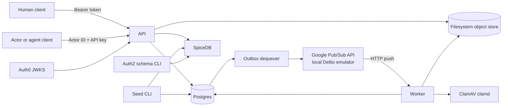
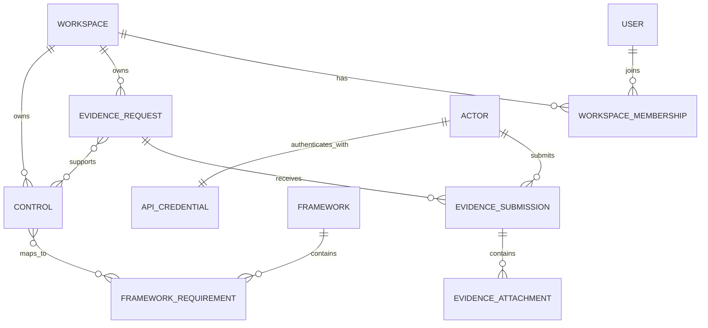

# Proofplane Architecture

This doc is a code-level reference, not a target-state design. Planned changes
belong in [`docs/epics/`](./epics/README.md).

## System Summary

Proofplane is a single Rust crate compiled into six binaries. The implemented
product is an HTTP API plus an asynchronous attachment-processing pipeline:

- The `api` binary serves human management routes and actor-facing compliance
  routes.
- The `dequeuer` binary publishes transactional outbox rows to Google Pub/Sub.
- The `worker` binary receives Pub/Sub push deliveries, scans attachments with
  ClamAV, and finalizes clean objects.
- The `seed` and `authz-schema` binaries initialize local application data and
  SpiceDB schema.
- The `mcp` binary is currently a scaffold. It runs migrations and exits without
  binding a server.

Postgres is the primary application datastore. SpiceDB makes actor data-plane
authorization decisions. Auth0 verifies human identities. Attachment bytes live
in a filesystem object store in the implemented runtime. Pub/Sub connects the
outbox dequeuer to the worker, and ClamAV scans quarantined attachment streams.



## Runtime Processes

| Binary | Runtime role | Listens | Main dependencies | Current behavior |
| --- | --- | --- | --- | --- |
| `api` | Synchronous HTTP application | `server.api_bind` | Postgres, SpiceDB, Auth0 JWKS, object storage | Runs migrations, constructs the Axum router, and serves until Ctrl-C. |
| `worker` | Pub/Sub push consumer | `server.worker_bind` | Postgres, object storage, ClamAV | Runs migrations and serves push, health, and metrics routes until Ctrl-C. |
| `dequeuer` | Transactional outbox publisher | None | Postgres, Pub/Sub | Runs migrations, provisions topics/subscription, and polls the outbox until Ctrl-C. It currently requires `PUBSUB_EMULATOR_HOST`. |
| `mcp` | MCP placeholder | None | Postgres | Runs migrations, logs a scaffold message, and exits. `server.mcp_bind` is not used. |
| `seed` | Idempotent local fixture loader | None | Postgres, SpiceDB | Runs migrations; seeds workspaces, users, actors, one API key, SpiceDB membership, requests, frameworks, requirements, and controls. |
| `authz-schema` | SpiceDB schema deployment CLI | None | SpiceDB | Reads `spicedb.schema_path` and writes the schema explicitly. |

The API, worker, dequeuer, MCP, and seed binaries all run application database
migrations during startup. SpiceDB schema deployment is deliberately separate:
normal application startup never writes the authorization schema.

## Local Topology

`docker-compose.yml` supplies four local dependencies:

- Postgres 16 on `127.0.0.1:5432`.
- Deltio, a Google Pub/Sub emulator, on `127.0.0.1:8085`.
- SpiceDB on `127.0.0.1:50051`.
- ClamAV `clamd` on `127.0.0.1:3310`.

SpiceDB uses a separate `proofplane_spicedb` database inside the same Postgres
container. Docker Compose creates that database and runs SpiceDB's own datastore
migrations before starting SpiceDB.

The local object store is not a container. It writes beneath `.local/storage`.
The Pub/Sub push endpoint is
`http://host.docker.internal:3001/pubsub/messages`, allowing the emulator
container to call the worker running on the host.

## Code Organization And Dependency Direction

The crate is organized into recognizable application layers:

```text
src/bin/             process entrypoints and dependency composition
src/routes/          HTTP transport, DTOs, middleware, response mapping
src/worker.rs        Pub/Sub push transport and event dispatch
src/handlers/        message-driven business logic
src/services/        router-facing business logic and orchestration
src/domain/          domain entities, typed IDs, enums, validation rules
src/repository/      concrete Postgres persistence and transaction contexts
src/authentication/  Auth0 and API-key authentication
src/authorization/   SpiceDB authorization adapter
src/object_storage/  object-store contract and filesystem implementation
src/pubsub/           publisher contract and Google Pub/Sub implementation
src/scanner/          ClamAV protocol adapter
src/store/            Postgres connection pools and migrations
src/config/           YAML loading, parsing, and validation
src/observability/    tracing subscriber setup
```

The usual request-driven dependency path is:

```text
route -> service -> repository -> Postgres
```

Routes own HTTP concerns: extraction, DTO conversion, validation error mapping,
authentication middleware, authorization middleware, and response
serialization. Services implement business logic on behalf of routes. They
coordinate repository operations, transaction boundaries, external
dependencies, and outbox messages when a use case needs asynchronous follow-up.
Repositories own SQL and convert rows into domain types. Domain modules do not
depend on Axum, Postgres, SpiceDB, or generated protobuf types.

The architecture is pragmatic rather than strictly hexagonal:

- `Postgres` is a concrete repository gateway, not a repository trait.
- `EvidenceSubmissionService` depends directly on `FilesystemObjectStore`.
- The API and worker dependency structs also require `FilesystemObjectStore`.
- `AttachmentScanHandler` depends directly on the filesystem store and concrete
  ClamAV scanner.
- `AttachmentFinalizationHandler` is generic over the `ObjectStore` trait.
- Pub/Sub publishing is behind a `Publisher` trait, which supports a fake in
  unit tests.

The active Production Runtime Adapters epic tracks removal of the
filesystem-only composition constraints.

## Composition Roots

Each binary in `src/bin/` is a composition root. Shared library modules do not
load global configuration or construct production clients on their own.

The common startup sequence is:

1. Load the YAML file named by `PROOFPLANE_CONFIG`.
2. Validate all configured fields into typed configuration.
3. Initialize tracing.
4. Connect to Postgres and run embedded Refinery migrations.
5. Construct process-specific pools and external clients.
6. Start the server or polling loop.

`AppDependencies` and `WorkerAppDependencies` make HTTP router construction
explicit and allow integration tests to compose in-process servers with test
dependencies.

## Configuration

Configuration is loaded from one YAML file. The loader first deserializes into
raw string-oriented types, then validates into typed values such as
`SocketAddr`, `Url`, `PathBuf`, positive integers, enums, and `SecretString`.
Validation accumulates independent field errors rather than stopping at the
first invalid field.

Configuration groups are:

- `server`: API, worker, and reserved MCP bind addresses.
- `postgres`: application connection string.
- `pubsub`: project, worker subscription, push endpoint, and maximum delivery
  attempts.
- `spicedb`: gRPC endpoint, preshared key, and schema file.
- `auth0`: issuer, audience, and JWKS URL.
- `object_storage`: filesystem or GCS-shaped configuration.
- `scanner`: clamd address and connection/scan timeouts.
- `uploads`: maximum multipart attachment size.
- `observability`: log format and default filter.
- `worker`: concurrency, local retry count, and shutdown grace.
- `health`: liveness/readiness paths and dependency timeout.

Some accepted configuration is not yet wired into runtime behavior:

- GCS configuration is parsed, but object-store construction returns
  `UnsupportedBackend`.
- `server.mcp_bind` is unused.
- `worker.concurrency`, `worker.retry_attempts`, and
  `worker.shutdown_grace_seconds` are not used by the worker.
- The dequeuer reuses `worker.retry_attempts` as its publish `max_attempts`.

## Domain Model

The workspace is the tenant boundary. Workspace-owned rows are always queried
or mutated with a workspace predicate in actor-facing repository contexts.

The implemented domain graph is:



Key distinctions:

- `User` is an Auth0-backed human management identity.
- `Actor` is a data-plane identity used by agents, integrations, services, and
  other API clients.
- `WorkspaceMembership` grants a human the `owner` or `admin` role in Postgres.
- SpiceDB `workspace#member` relationships grant actors all currently modeled
  read/write permissions.
- Frameworks and framework requirements are global reference data.
- Controls, evidence requests, submissions, and attachments are
  workspace-scoped.

Typed UUID newtypes prevent accidental interchange of workspace, user, actor,
control, request, submission, and attachment identifiers inside Rust code.
Persisted enum strings are parsed into domain enums; unknown database values
become repository invalid-data errors.

### Attachment State Machine

The database constrains attachment status to:

```text
pending -> finalizing -> uploaded
pending -> contains_virus
pending -> failed
```

In the current implementation, `contains_virus` and `failed` transitions occur
only from `pending`. A finalization error leaves the row `finalizing` for
redelivery.

## Identity And Authorization

Proofplane currently has two deliberately separate identity planes.

### Human Management Plane

Human routes use an Auth0 bearer token:

1. The route middleware extracts `Authorization: Bearer <token>`.
2. `Auth0TokenVerifier` verifies the RS256 token through a remotely cached JWKS
   set.
3. Issuer, audience, validity window, and non-empty subject are checked.
4. `UserAuthenticator` upserts the user by `auth0_sub`.
5. A `UserContext` is attached to the request.
6. Workspace management authorization reads `workspace_memberships` from
   Postgres.

The implemented human routes are `GET /me`, workspace create/list, and member
removal. Workspace creation and the owner membership are committed in one
Postgres transaction. The last-owner guard locks owner membership rows before
counting and deleting.

Human workspace ownership does not automatically create a SpiceDB actor
relationship. The human and actor planes are separate.

### Actor Data Plane

Actor-facing routes require:

- `x-proofplane-actor-id`
- `x-proofplane-api-key`
- A workspace UUID in the route path

Authentication loads the actor and its single credential from Postgres,
rejects revoked or expired credentials, extracts the API key ID, and verifies
the Argon2id credential hash.

After authentication, route-specific middleware asks SpiceDB for a fully
consistent workspace permission check. The current schema maps every permission
to the single `member` relation:

- `read_evidence_requests`
- `write_evidence_requests`
- `read_evidence_submissions`
- `write_evidence_submissions`
- `read_controls`
- `write_controls`

Denied authorization returns `404 Not Found` to avoid revealing resource or
workspace existence. SpiceDB request failures return an internal error, so an
authorization dependency failure does not grant access.

Postgres workspace predicates provide a second tenant boundary after the
SpiceDB route check. Cross-workspace IDs therefore resolve as absent even when
the caller is authorized for the workspace in the URL.

## HTTP API

The API router combines public infrastructure routes, human routes, and
actor-facing routes.

### Public And Operational Routes

| Method | Path | Purpose |
| --- | --- | --- |
| `GET` | configured liveness path, locally `/livez` | Process liveness only. |
| `GET` | configured readiness path, locally `/readyz` | Acquire a Postgres connection and run `SELECT 1` with timeouts. |
| `GET` | `/metrics` | Render the process Prometheus registry. |
| `GET` | `/version` | Return package name and version. |

### Human Routes

| Method | Path | Purpose |
| --- | --- | --- |
| `GET` | `/me` | Return the JIT-provisioned Auth0 user. |
| `POST` | `/workspaces` | Create a workspace and owner membership atomically. |
| `GET` | `/workspaces` | List the authenticated user's memberships and roles. |
| `DELETE` | `/workspaces/{workspace_id}/members/{user_id}` | Remove a member while preserving at least one owner. |

### Actor Routes

| Method | Path | Purpose |
| --- | --- | --- |
| `GET` | `/workspaces/{workspace_id}/frameworks` | List global framework reference data. |
| `GET` | `/workspaces/{workspace_id}/frameworks/{framework_id}/requirements` | List framework requirements. |
| `POST`, `GET` | `/workspaces/{workspace_id}/controls` | Create or list controls. |
| `GET`, `PUT` | `/workspaces/{workspace_id}/controls/{control_id}` | Read or replace a control. |
| `POST`, `GET` | `/workspaces/{workspace_id}/evidence-requests` | Create or list evidence requests. |
| `GET` | `/workspaces/{workspace_id}/evidence-requests/due` | List active requests due at the optional `now` query instant. |
| `GET`, `PUT` | `/workspaces/{workspace_id}/evidence-requests/{evidence_request_id}` | Read or replace an evidence request. |
| `POST`, `GET` | `/workspaces/{workspace_id}/evidence-requests/{evidence_request_id}/control-mappings` | Create or list request-to-control mappings. |
| `DELETE` | `/workspaces/{workspace_id}/evidence-requests/{evidence_request_id}/control-mappings/{control_id}` | Delete a mapping. |
| `POST` | `/workspaces/{workspace_id}/evidence-requests/{evidence_request_id}/submissions` | Create an evidence submission. |
| `GET` | `/workspaces/{workspace_id}/evidence-submissions/{submission_id}` | Read a submission with attachments. |
| `POST` | `/workspaces/{workspace_id}/evidence-submissions/{submission_id}/attachments` | Stream one multipart file into quarantine. |

Routes use transport DTOs rather than serializing domain types directly.
Validation uses the crate's `Validation` type and `validate!` macro to collect
multiple domain errors into one stable JSON error response.

All API requests receive an `x-request-id`. A valid inbound UUID is preserved;
otherwise a UUID is generated. The ID is returned in the response, recorded in
the tracing span, and copied into attachment outbox messages.

## Persistence Architecture

`Postgres` wraps a `deadpool-postgres` pool. SQL is colocated by aggregate in
repository modules. There is no ORM.

Three repository execution contexts express transaction and tenant needs:

- `Postgres` methods perform global or standalone operations.
- `TransactionContext` wraps a general write transaction.
- `ActorTransactionContext` carries `workspace_id` and `actor_id` through a
  write transaction.
- `ActorReadContext` carries the same actor context with a pooled read client.

Actor context is not injected into Postgres session variables. Repository SQL
must use the context fields explicitly in predicates and inserted ownership
columns.

Important atomic operations include:

- Workspace creation plus owner membership.
- Control mutation plus framework-requirement mappings.
- Attachment row creation plus `attachment.scan_requested` outbox insertion.
- Attachment transition to `finalizing` plus
  `attachment.finalization_requested` outbox insertion.

Known database artifacts that are not exposed through current behavior:

- `audit_events` exists but has no repository or application usage.
- `latest_evidence_submission_for_request` exists in the repository but has no
  route or service method.
- `list_exhausted_outbox_messages` exists but no runtime consumes it.

## Object Storage

`ObjectStore` defines put, get, head, copy, and delete operations. Only
`FilesystemObjectStore` is implemented and constructible.

Object keys are validated paths beginning with a workspace UUID:

```text
workspaces/{workspace_id}/...
```

Traversal segments, absolute paths, backslashes, NUL bytes, and malformed
workspace IDs are rejected.

The filesystem adapter stores:

```text
{root}/objects/{object_key}
{root}/metadata/{object_key}.json
```

The metadata sidecar records object key, content type, length, and SHA-256.
Writes stream chunks to disk while calculating length and SHA-256. Gets return a
64 KiB chunk stream. Copies are implemented as a streamed get followed by put.
Deletes remove both bytes and metadata and are idempotent.

Attachment keys have two forms:

```text
workspaces/{workspace_id}/quarantine/evidence-submissions/{submission_id}/attachments/{upload_id}/{filename}
workspaces/{workspace_id}/evidence-submissions/{submission_id}/attachments/{attachment_id}/{filename}
```

## Attachment Upload And Processing

Attachment handling is the main cross-process workflow.

### 1. API Upload

1. The actor is authenticated and authorized to write submissions.
2. The API confirms the submission exists inside the workspace.
3. Axum streams the first multipart field named `file`.
4. The route requires an RFC structured `Content-Digest` containing CRC32C.
5. The service streams bytes to a unique quarantine key.
6. The filesystem store calculates content length and SHA-256 while the route
   calculates CRC32C.
7. A checksum mismatch deletes the staged object and returns `400`.
8. The service inserts the `pending` attachment and scan-request outbox row in
   one actor-scoped Postgres transaction.
9. A database failure triggers best-effort deletion of the quarantine object.
10. The API returns `202 Accepted`.

Only the first multipart field is processed. Additional fields are ignored.

### 2. Outbox Publication

The dequeuer polls due rows in batches of 100 and processes them sequentially.
It serializes a self-describing JSON envelope and publishes it to
`proof.message_bus`.

On successful publish, it deletes the outbox row. On failure, it increments
`attempt_count` and schedules exponential backoff capped at five minutes by
default.

The publish and row deletion are separate operations, so duplicate publication
is possible if publication succeeds and deletion fails. Worker handlers are
therefore designed for at-least-once delivery.

The configured `max_attempts` does not currently stop publication. An exhausted
row is logged and rescheduled at the maximum delay, after which it becomes due
again. There is no outbox dead-letter consumer.

### 3. Pub/Sub Delivery

At dequeuer startup, the Pub/Sub adapter ensures:

- Topic `proof.message_bus`.
- Topic `proof.message_bus.dead_letter`.
- A push subscription targeting the configured worker endpoint.
- A dead-letter policy with the configured maximum delivery attempts.

The worker accepts Google Pub/Sub's push envelope at `/pubsub/messages`,
base64-decodes the data, validates the internal envelope, and dispatches by
`event_type`.

Malformed envelopes, unknown event types, and permanently invalid handler
payloads are acknowledged with `204`. Retryable handler failures return `500`,
causing Pub/Sub redelivery.

### 4. Malware Scan

For `attachment.scan_requested`, the handler:

1. Loads a row only when attachment ID, quarantine key, and `pending` status
   match.
2. Treats absent work as a duplicate or stale delivery and acknowledges it.
3. Loads the quarantine object and verifies content type, length, and SHA-256
   against Postgres.
4. Streams object chunks to ClamAV using the `zINSTREAM` protocol.
5. Applies the result.

Outcomes:

- Clean: atomically set `finalizing` and enqueue a finalization event.
- Malicious: set `contains_virus`.
- ClamAV `ERROR` response: set `failed`.
- Missing quarantine object: set `failed`.
- Adapter or metadata failures before the final Pub/Sub delivery: return `500`.
- The same failures on or after the configured final delivery: set `failed` and
  acknowledge.

The current final-delivery behavior acknowledges terminal scan failure rather
than allowing the message to reach the Pub/Sub dead-letter topic.

### 5. Finalization

For `attachment.finalization_requested`, the handler:

1. Loads a row only when attachment ID, submission ID, quarantine key, and
   `finalizing` status match.
2. Treats absent work as duplicate or stale.
3. Streams a copy from the quarantine key to the stable attachment key.
4. Updates Postgres to the final key and `uploaded` status.
5. Best-effort deletes the quarantine object after a successful update.

Copy or database failures return `500`, leaving the row `finalizing`. A copied
final object can therefore exist before the database update succeeds, and a
redelivery may repeat the copy. No local `Retryable` loop is wired into this
handler yet.

## Messaging And Idempotency

The pipeline uses conditional state transitions as idempotency guards:

- Scan work loads only `pending` rows with the expected key.
- Finalization requests change `pending` to `finalizing` before publication.
- Finalization work loads only `finalizing` rows with the expected IDs and key.
- Upload completion changes only the matching `finalizing` row.
- Duplicate or stale deliveries are acknowledged without repeating domain
  transitions.

There is no inbox table or globally unique message-consumption record. The
business state itself provides idempotency.

The outbox poll does not claim rows with locks or leases. Multiple dequeuer
instances can read and publish the same due row concurrently. The current
runtime should therefore be treated as a single-dequeuer topology.

## Error Semantics

The HTTP API returns a stable JSON envelope:

```json
{
  "error": {
    "code": "bad_request",
    "message": "request validation failed",
    "details": []
  }
}
```

Important mappings:

- Domain validation becomes `400`.
- Missing or concealed resources become `404`.
- Oversized multipart payloads become `413`.
- Known uniqueness conflicts become `409` with specific codes.
- Missing actor or human credentials become `401`.
- Readiness failures become `503`.
- Repository, storage, and unexpected dependency failures generally become
  `500`.

The worker has a narrower contract: `204` acknowledges a delivery and `500`
requests Pub/Sub retry.

## Observability And Operations

The API and worker install independent Prometheus recorders and expose
`/metrics`. No application counters, gauges, or histograms are currently
recorded, so the endpoint primarily exposes recorder output.

Both servers use `tower-http` trace layers. API spans record method, matched
path, request ID, actor ID, and user ID. Completion logs include status and
latency. Worker processing adds message ID, event type, aggregate identifiers,
delivery attempt, request ID, and acknowledgement status.

Tracing writes to stderr in configured pretty or JSON format. `RUST_LOG`
overrides the configured default filter. CLI tracing is disabled unless
`PROOFPLANE_CLI_LOG` is truthy.

Liveness reports only that the HTTP process is running. Readiness checks only
Postgres. Worker readiness does not currently probe object storage or ClamAV,
and API readiness does not probe SpiceDB, Auth0 JWKS, or object storage.

The `audit_events` table is dormant. Durable audit behavior is not implemented;
current activity visibility comes from operational tracing logs.

## Generated Code Boundary

`build.rs` compiles vendored AuthZed protobufs. Generated request and response
types remain private inside `authorization::spicedb`; domain, service, route,
and repository interfaces do not expose generated protobuf types.

## Testing Architecture

Unit tests are colocated with modules and cover parsing, validation, adapter
protocol behavior, retry helpers, message envelopes, and pure policy.

Docker-backed integration tests run as one `tests/integration` target:

- Postgres uses Testcontainers and real migrations.
- SpiceDB uses a container and the real schema.
- ClamAV uses a shared container for worker tests.
- Deltio exercises the Google Pub/Sub client and subscription reconciliation.
- Axum API and worker routers run in process through `axum-test`.
- Filesystem object storage uses per-test temporary roots.
- Auth0 is replaced by a fake `TokenVerifier`; API-key hashing and verification
  remain real.

Integration coverage emphasizes observable behavior and transactional
guarantees: tenant isolation, auth ordering, JIT provisioning, conflicts,
attachment integrity, outbox creation, duplicate worker delivery, rollback,
scanner failures, and object finalization.

## Current Implementation Boundaries

The following are not part of the implemented architecture yet:

- A running MCP server or MCP tools.
- A browser application.
- GCS object storage.
- Production Pub/Sub startup without `PUBSUB_EMULATOR_HOST`.
- Multiple API credentials per actor or actor-management HTTP routes.
- Attachment download grants or attachment byte-serving routes.
- Trusted source material and auditor packet models.
- Structured audit-log contracts and retention.
- Application metrics beyond scrape endpoints.
- Worker concurrency control, graceful shutdown timing, or local finalization
  retries from worker configuration.

These items are tracked in the epic portfolio and should not be inferred from
configuration fields, repository helpers, or scaffolding modules.

## Source Map

The most important implementation entrypoints are:

- [`src/bin/api.rs`](../src/bin/api.rs) and [`src/app.rs`](../src/app.rs):
  API composition and router.
- [`src/bin/worker.rs`](../src/bin/worker.rs) and
  [`src/worker.rs`](../src/worker.rs): worker composition, push decoding, and
  dispatch.
- [`src/bin/dequeuer.rs`](../src/bin/dequeuer.rs) and
  [`src/dequeuer/mod.rs`](../src/dequeuer/mod.rs): outbox publication loop.
- [`src/services/`](../src/services/): router-facing business logic and
  orchestration.
- [`src/handlers/`](../src/handlers/): message-driven attachment business
  logic.
- [`src/repository/`](../src/repository/): SQL and transaction contexts.
- [`src/domain/`](../src/domain/): domain types and validation.
- [`migrations/`](../migrations/): authoritative application schema.
- [`authz/spicedb/proofplane.zed`](../authz/spicedb/proofplane.zed):
  authoritative actor authorization schema.
- [`config/local.yaml`](../config/local.yaml) and
  [`docker-compose.yml`](../docker-compose.yml): implemented local topology.
