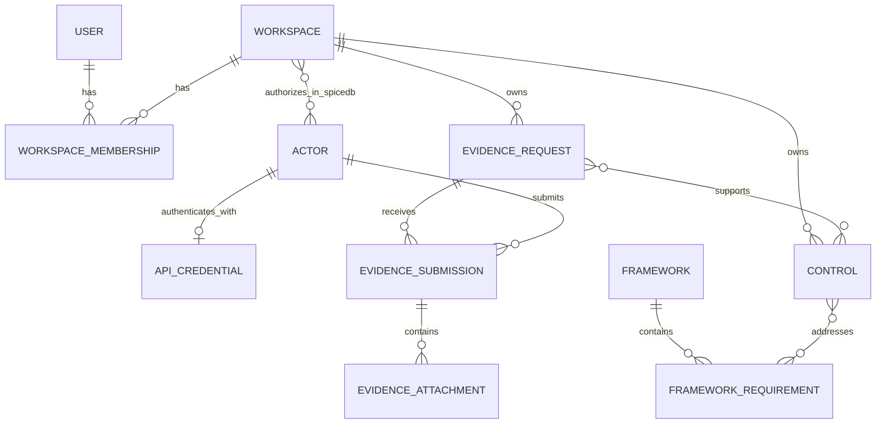

# Proofplane Domain Model

This document describes the domain model implemented in the repository today.
It complements the runtime-focused [`architecture.md`](./architecture.md).
Planned domain additions belong in [`docs/epics/`](./epics/README.md) until
they are implemented.

## Core Boundaries

Proofplane currently separates three concerns:

- Human management: Auth0-backed users create and manage workspaces.
- Actor activity: API-authenticated actors perform compliance and evidence
  operations inside workspaces.
- Compliance evidence: global framework reference data connects to
  workspace-owned controls, evidence requests, submissions, and attachments.

The workspace is the tenant boundary for customer-owned compliance data.
Frameworks and framework requirements are global reference data shared by all
workspaces.



The workspace-to-actor relationship is stored in SpiceDB rather than the
application database.

## Identity Model

### Users

A `User` is a human management-plane identity:

- It is keyed externally by unique `auth0_sub`.
- It may carry optional email and name claims.
- It is created or updated when a valid Auth0 token is first used.
- It receives workspace authority through `WorkspaceMembership`.

Users do not submit evidence and are not used by actor-facing compliance
routes. A user is not automatically mapped to an `Actor`.

### Actors

An `Actor` is a data-plane identity that performs work through the API.
Implemented actor kinds are:

- `human_user`
- `ai_agent`
- `service_account`
- `integration`
- `policy_automation`
- `system`

The `human_user` actor kind does not link an actor to a `User`; the two identity
models are currently independent.

An actor is authorized for a workspace through a SpiceDB
`workspace#member@actor` relationship. The current SpiceDB schema grants every
modeled read and write permission to members. The application database does not
contain an actor-to-workspace membership table.

### API Credentials

An `ApiCredential` authenticates one actor. It stores:

- A public credential record ID and extracted key ID.
- An Argon2id credential hash, never the raw key.
- A display name.
- Optional expiration and revocation timestamps.

The current schema enforces one credential per actor. Credential rotation
through multiple concurrent keys is not yet part of the implemented model.

## Workspaces And Human Membership

A `Workspace` is the tenant container. It has:

- A UUID identity.
- An optional globally unique slug.
- A name.
- A creation timestamp.

A `WorkspaceMembership` connects one user to one workspace with either an
`owner` or `admin` role. The pair of user and workspace is unique.

Implemented membership rules are:

- Creating a workspace also creates an owner membership for the caller in one
  transaction.
- Owners and admins are authorized for member management; the currently
  exposed operation is member removal.
- A workspace must retain at least one owner.
- Removing the last owner is rejected.
- Unauthorized membership operations are presented as absent resources rather
  than exposing workspace existence.

The last-owner rule is enforced in the service transaction, including row locks
for concurrent removal safety. It is not a database check constraint.

Human membership and actor authorization are separate. Owning a workspace does
not create a SpiceDB relationship, and granting an actor access does not create
a human membership.

## Compliance Reference Data

### Frameworks

A `Framework` is a global compliance standard, such as SOC 2. Its code is
globally unique.

A `FrameworkRequirement` is a canonical objective within a framework. Its code
is unique within that framework. Requirements are reference data; workspaces do
not edit or own them.

### Controls

A `Control` is a workspace-owned practice describing how that organization
addresses compliance objectives. Its editable fields are:

- Code, unique within the workspace.
- Title.
- Description.
- Mapped framework requirements.

A control can address zero, one, or many framework requirements. A requirement
can be addressed by controls from many workspaces. The relationship is stored
as a first-class many-to-many mapping rather than embedding requirements inside
the control row.

Control creation and replacement update the control and all requirement
mappings in one transaction. Referenced framework requirements must exist.

## Evidence Requests

An `EvidenceRequest` is a workspace-owned definition of evidence that should be
collected. It records:

- A title, description, and collection instructions.
- A cadence: `once`, `monthly`, `quarterly`, or `annually`.
- `schedule_anchor_at`, the anchor for recurrence calculations.
- `due_at`, the currently stored concrete deadline.
- Optional positive `freshness_window_days`.
- A lifecycle status: `active`, `paused`, or `retired`.

Scheduling and freshness represent different questions:

- Cadence, anchor, and due time describe when evidence is expected.
- Freshness describes how long submitted evidence may remain acceptable.

The current application stores these values but does not advance recurring
schedules or derive a current/stale usability status. The due query returns
active requests whose stored `due_at` is at or before the requested instant.

### Request-To-Control Mappings

An `EvidenceRequestControlMapping` states that fulfilling an evidence request
supports a control. It includes a required rationale explaining the
relationship.

This is many-to-many:

- One request can support several controls.
- One control can rely on several requests.
- A request and control may be mapped only once.
- Both records must belong to the same workspace.

The mapping belongs to the request definition, so later submissions inherit the
same compliance meaning without being mapped individually.

## Evidence Submissions

An `EvidenceSubmission` is a concrete response to one evidence request. It
records:

- The actor that submitted it.
- The time Proofplane received it.
- A coverage start and end.
- The source system.
- The collection method.

The coverage window describes the period the evidence speaks for. It is
independent of `received_at`, which records ingestion time. The end of the
coverage window cannot precede its start.

A submission does not store a workspace ID directly. Its tenant is derived
through:

```text
evidence_submission -> evidence_request -> workspace
```

Repository operations join through that path and require the current workspace,
which prevents cross-workspace reads and writes.

The repository can select the latest submission for a request by
`received_at DESC, id DESC`, but that capability is not exposed by a service or
route yet.

## Evidence Attachments

An `EvidenceAttachment` is an uploaded object belonging to one submission. It
records:

- Filename and content type.
- Non-negative content length.
- Globally unique object-storage key.
- SHA-256 and CRC32C checksums.
- Upload lifecycle status.

The attachment's workspace is derived through its submission and evidence
request. Object keys also include the workspace UUID as a storage-level tenant
boundary.

### Integrity

The two checksums serve different implemented purposes:

- CRC32C verifies that the multipart bytes received by the API match the
  caller-provided `Content-Digest`.
- SHA-256, content length, and content type are persisted from object storage
  and rechecked before malware scanning.

An attachment row is created only after quarantine storage succeeds. The
attachment row and its scan-request outbox message are then committed in one
database transaction.

### Lifecycle

The implemented statuses are:

| Status | Meaning |
| --- | --- |
| `pending` | Quarantined bytes exist and malware scanning is pending. |
| `finalizing` | The scan was clean and stable-object finalization was requested. |
| `uploaded` | The stable object key is stored and the attachment completed processing. |
| `contains_virus` | Malware was detected. |
| `failed` | Scanning or access to the quarantined object failed terminally. |

Implemented transitions are:

```text
pending -> finalizing -> uploaded
pending -> contains_virus
pending -> failed
```

Transitions are conditional on the current status and expected object key.
Duplicate or stale worker messages therefore make no further state change.

A finalization error leaves the attachment `finalizing` so Pub/Sub redelivery
can retry it. After a successful finalization update, deletion of the
quarantine object is best effort.

Only `uploaded` establishes that the attachment completed the implemented
malware-scan and finalization pipeline. The current API does not yet serve
attachment bytes or issue download grants.

## Supporting Process Records

### Outbox Messages

`OutboxMessage` is supporting infrastructure for domain workflows rather than a
customer-facing entity. It records:

- Topic and event type.
- Aggregate type and ID.
- JSON payload.
- Optional originating request ID.
- Publish attempt count and next available time.

Domain state changes that require asynchronous follow-up append an outbox row
inside the same Postgres transaction. This currently happens when:

- A new attachment requests malware scanning.
- A clean scan requests attachment finalization.

The outbox provides atomic persistence of state and intent to publish. Delivery
is at least once, so attachment handlers rely on conditional domain transitions
for idempotency.

### Audit Events

The database contains an `audit_events` table, but no current domain,
repository, or service behavior uses it. It is not part of the active domain
model.

## Domain Invariants

Important implemented invariants include:

- Workspace slug is globally unique when present.
- Auth0 subject is unique per user.
- A user has at most one membership in a workspace.
- Workspace membership role is `owner` or `admin`.
- A workspace retains at least one owner through service logic.
- An actor has at most one API credential.
- Revoked or expired credentials cannot authenticate.
- Framework code is globally unique.
- Requirement code is unique within a framework.
- Control code is unique within a workspace.
- A control-to-requirement mapping is unique.
- A request-to-control mapping is unique and workspace-local.
- Evidence request cadence and status use constrained values.
- Freshness is absent or positive.
- Submission coverage end is not before coverage start.
- Submission and attachment operations are scoped through the owning request's
  workspace.
- Attachment length is non-negative and object key is unique.
- Attachment status uses the constrained lifecycle values.

Text validation at the API boundary rejects blank required fields while
preserving non-blank text as supplied.

## Deliberate Absences

The implemented domain does not currently include:

- Approval or rejection state for submissions.
- A derived evidence usability or freshness result.
- Curated source material.
- Auditor packet or export entities.
- Attachment download grants.
- A durable structured audit-event model used by the application.
- Human-user-to-actor linkage.
- Multiple API credentials per actor.
- Fine-grained actor roles within a workspace.

These concepts must not be inferred from planned epic specs or dormant schema
artifacts when reasoning about current behavior.

## Source Map

The authoritative implementation sources are:

- [`src/domain/`](../src/domain/): domain types, typed IDs, enums, and basic
  validation.
- [`src/services/`](../src/services/): business rules and transaction
  orchestration.
- [`src/repository/`](../src/repository/): persistence scoping and invariants.
- [`migrations/`](../migrations/): database constraints and relationships.
- [`authz/spicedb/proofplane.zed`](../authz/spicedb/proofplane.zed): actor
  workspace authorization.
