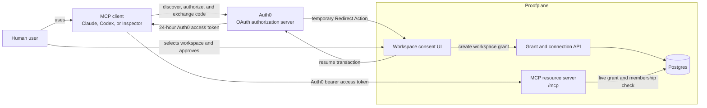
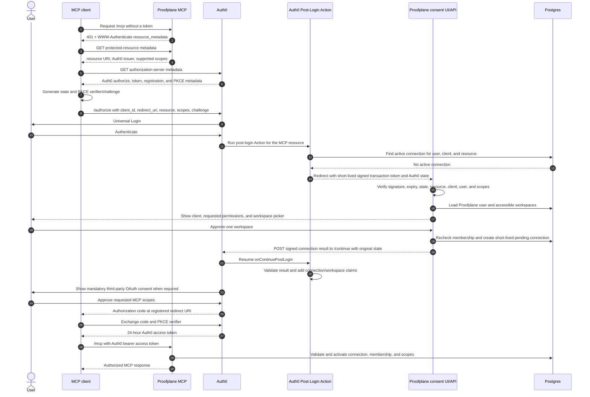
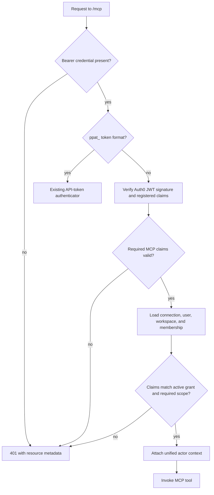
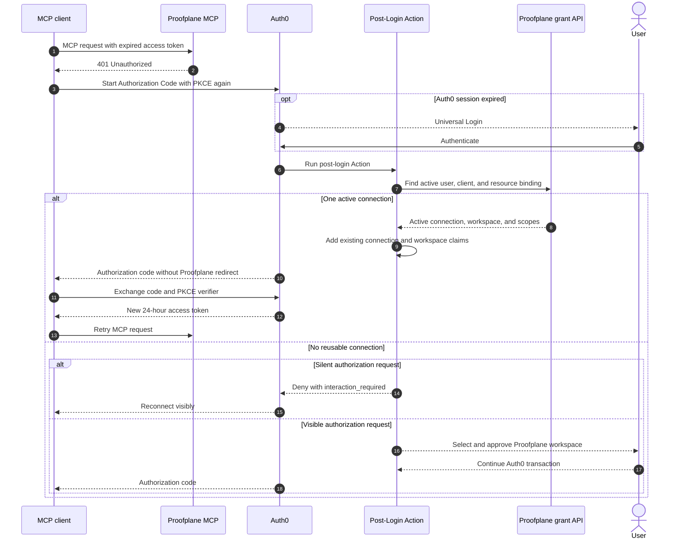

# Agent Connector Onboarding Spec

## Goal

Let a non-technical operations or compliance user connect Proofplane to an AI
agent without installing a CLI, editing configuration, or copying a long-lived
API token.

The core product principle is **connect an account, not install a server**.
Proofplane remains a hosted Streamable HTTP MCP service. Compatible clients
discover Auth0, complete browser authorization, and receive credentials
without exposing them to the user or model.

## Architecture Decision

> **Revision — 2026-07-02:** Ticket 001 now establishes only standard Auth0
> OAuth discovery and user access-token verification. Redirect Actions,
> continuation handling, custom workspace claims, persistence, and runtime
> workspace authorization all begin in ticket 002. This prevents a
> development-only synthetic grant mechanism from becoming a ticket 001
> contract.
>
> **Revision — 2026-07-05:** The former combined ticket 002 is split into
> connection persistence and Action-facing contracts (002), browser consent
> and Redirect Action claim injection (003), and MCP runtime enforcement
> (004). This lets the persistence contract ship without changing MCP
> authorization or requiring browser code.

Auth0 is the OAuth authorization server for remote MCP clients, following
[Auth0's direct MCP authorization flow](https://auth0.com/ai/docs/mcp/intro/why-auth-for-mcp).
Auth0 owns:

- authorization-server discovery;
- client registration and redirect-URI validation;
- Authorization Code with PKCE;
- login and OAuth consent;
- access-token issuance;
- signing-key publication and rotation;
- user-grant management; and
- OAuth protocol errors.

Proofplane does not implement `/oauth/authorize`, `/oauth/token`,
authorization-code storage, or a token-signing keyring. The initial release
does not request `offline_access` and Auth0 does not issue an MCP refresh token.
Auth0 access tokens expire after 24 hours.

Proofplane remains responsible for:

- MCP Protected Resource Metadata and `401` challenges;
- selecting and approving one Proofplane workspace during authorization;
- durable agent-connection and audit records;
- Auth0 access-token validation;
- live workspace membership, scope, and revocation enforcement; and
- the hosted MCP tools and application experience.

The workspace grant is integrated into Auth0 through a post-login Redirect
Action. The Action pauses Auth0's transaction, sends the browser to a
Proofplane workspace-consent page, resumes at Auth0, and adds the approved
Proofplane connection and workspace identifiers to the Auth0 access token.

This replaces the earlier proposal for a Proofplane-owned OAuth facade and
Proofplane-issued PASETO credentials. The reason is operational and security
simplicity: Auth0 already implements the security-sensitive OAuth server
behavior required by MCP.

## Current Reality

The MCP runtime and core tools already use Streamable HTTP at `/mcp`. They
authenticate requests with a pre-provisioned, workspace-bound `ppat_` bearer
token. The website can issue that token, but this is the wrong default for
non-technical users:

- the user must create, copy, and preserve a long-lived credential;
- credentials can leak through plaintext configuration or shell state;
- clients require different manual setup;
- browser-led consent and reconnection are unavailable; and
- connection lifecycle and audit attribution are token-centric.

Existing `ppat_` authentication remains supported for CI, unattended agents,
direct REST consumers, and MCP clients without interactive OAuth.

## Product Boundary

This epic delivers:

- Auth0-backed OAuth authorization for the hosted MCP endpoint;
- one-workspace, scoped agent connections;
- a guided website flow for supported clients;
- first-class Claude/Cowork and Codex distribution artifacts;
- generic remote-MCP instructions as a fallback; and
- connection visibility, revocation, and attributable audit events.

This epic does not:

- run a local Proofplane server;
- implement an OAuth authorization server in the Proofplane API;
- synchronize every Proofplane workspace into Auth0 Organizations;
- pass MCP credentials through prompts, tools, logs, or browser storage;
- enable open Dynamic Client Registration in production; or
- support unattended OAuth connections that must outlive the access token; or
- remove existing API-token authentication.

Auth0 Organizations are not used for workspace binding. Auth0 currently
documents Organization user flows as
[unavailable for third-party applications](https://auth0.com/docs/get-started/applications/first-party-and-third-party-applications),
while MCP clients are third-party applications. A Proofplane Redirect Action
bridge provides workspace selection without depending on that unsupported
combination.

## Roles And Trust Boundaries

| Role | Component | Responsibility |
| --- | --- | --- |
| Resource owner | Proofplane user | Approves client access to one workspace |
| OAuth client | Claude, Codex, or another MCP harness | Holds credentials and calls MCP |
| Authorization server | Auth0 | Runs OAuth, login, consent, and access-token issuance |
| Resource server | Proofplane MCP | Validates Auth0 tokens and serves authorized tools |
| Domain authorization service | Proofplane API and database | Owns users, workspaces, grants, and revocation |

The MCP client is not the model. Credentials remain transport metadata held by
the client and must never enter model context.



## Target Journey

1. The user chooses Claude/Cowork, Codex, or another supported agent.
2. Proofplane opens the client's native connection path where one exists.
3. The client contacts the hosted MCP endpoint and receives an OAuth
   challenge.
4. The client discovers Auth0 and opens Auth0 Universal Login.
5. Auth0 authenticates the user and pauses at the Proofplane Redirect Action.
6. Proofplane shows the requested permissions and lets the user choose one
   accessible workspace.
7. Auth0 completes the authorization code flow and returns a 24-hour
   access token to the MCP client.
8. The client calls `/mcp`; Proofplane verifies the Auth0 token and the live
   workspace grant.
9. Proofplane records successful use and offers a useful first prompt.
10. After token expiry, the client starts authorization again. The Action
    reuses the one active workspace connection without showing the workspace
    page when it can do so safely.

The user never sees or copies the access token. If the client cannot restart
authorization automatically, the user reconnects it manually.

## Initial Authorization Flow



### Discovery

The MCP server returns `401 Unauthorized` with:

```http
WWW-Authenticate: Bearer resource_metadata="https://mcp.example/.well-known/oauth-protected-resource/mcp"
```

The protected-resource metadata identifies:

- `resource`: the canonical public MCP URI;
- `authorization_servers`: the Auth0 issuer; and
- `scopes_supported`: the minimal MCP permission set.

The MCP server owns this endpoint under
[RFC 9728](https://datatracker.ietf.org/doc/html/rfc9728). Auth0 owns
authorization-server metadata under
[RFC 8414](https://datatracker.ietf.org/doc/html/rfc8414).

Proofplane constructs and validates the complete `WWW-Authenticate` header
when the MCP application is assembled. An invalid metadata URL or header value
fails startup; request handling only clones the validated header.

The Auth0 tenant must enable the Resource Parameter Compatibility Profile so
the MCP `resource` parameter becomes the access-token audience as required by
[RFC 8707](https://datatracker.ietf.org/doc/html/rfc8707).

### Client Registration

Production first-class clients use Auth0's recommended manual Client ID
Metadata Document registration where supported. Manual third-party
application registration is the fallback. Auth0, not Proofplane, stores client
IDs, redirect URIs, grant types, and token-endpoint authentication policy.

Known clients must:

- be third-party applications;
- use Authorization Code with PKCE;
- use OAuth access tokens without depending on third-party OIDC support;
- use exact registered redirect URIs;
- be granted access only to the Proofplane MCP resource and approved scopes;
- use the `authorization_code` grant without `offline_access`; and
- expose stable client identity suitable for connection display and audit.

Open Dynamic Client Registration is deferred. Auth0's DCR endpoint is
unauthenticated when enabled and requires tenant ACL and default third-party
permission policy. Generic clients remain on API-token setup until that policy
is deliberately shipped.

### Auth0 Resource Server

The Auth0 tenant defines one API/resource server whose identifier exactly
matches the canonical public MCP resource URI, for example:

```text
https://mcp.proofplane.com/mcp
```

It uses:

- RS256 access tokens and Auth0's default `access_token` dialect;
- the concrete MCP scopes defined below;
- a 24-hour access-token lifetime;
- offline access disabled for the MCP resource; and
- domain-level identity connections usable by third-party clients.

The MCP runtime receives only public verification material through Auth0 JWKS.
Proofplane never receives Auth0 signing keys.

## Workspace Grant Bridge

Auth0 does not know Proofplane workspace membership. A post-login Redirect
Action integrates that domain decision without taking over OAuth.

### Ticket 001/002 delivery boundary

Ticket 001 ships Protected Resource Metadata, Authorization Code with PKCE
tenant configuration, and standard Auth0 user access-token validation. It
requires an RS256 signature from configured JWKS; exact issuer and MCP
audience; valid `exp`, `iat`, non-machine `sub`, and allowlisted `azp`; and
only the six known workspace scopes. Client-credentials identities,
`offline_access`, and unknown scopes are rejected. It has no Redirect Action,
continuation endpoint, claim namespace, Action shared secret, synthetic
workspace identifier, grant, or connection.

Verified ticket 001 Auth0 users may initialize MCP and list tools. Every
protected tool call fails closed because no workspace authorization exists.
Existing `ppat_` authorization and API-token audit actors remain unchanged.

Ticket 002 adds durable connection persistence, lifecycle operations, Action
shared-secret configuration, and authenticated internal resolve and
continuation contracts. Ticket 003 adds the Redirect Action, workspace picker,
signed browser transaction, and namespaced connection and workspace claims.
Ticket 004 adds protected-tool authorization and actor provenance.

## Agent Connection Foundation

Ticket 002 persists `agent_connections`, normalized permission rows, and
single-use authorization transactions. A partial unique constraint permits at
most one non-revoked pending or active connection for each
user/client/resource tuple. Pending creation transactionally removes an
expired pending row before inserting its replacement; a concurrent live
creation loses to the database constraint.

Ticket 002 tests keep the same interface boundary as the implementation:
Action route contracts are exercised through the HTTP test server, while
persistence and lifecycle behavior are exercised through a dedicated
repository integration suite. Route fixture setup may use repository
operations only to establish pending or active states that ticket 002 exposes
no API to create.

Connection records contain the Proofplane user and workspace, Auth0 subject
and client, client display-name snapshot, exact resource, lifecycle
timestamps, and no credential. Authorization transactions contain only
SHA-256 continuation and nonce digests plus a consumption timestamp. The
connection's pending expiration is the single authorization deadline used for
continuation consumption, activation, and expired-row replacement. A shared
`workspace_permissions` lookup table defines the canonical permission
vocabulary referenced by both API-token and agent-connection permission
mappings; the mappings remain separate so each retains direct foreign-key
ownership and cascade behavior.
API-token, continuation, and nonce digests use one redacted `Sha256Digest`
domain value type; their database columns continue to store the same 32-byte
SHA-256 output.

Repository and service operations support pending creation, denial,
single-use continuation consumption, exact reusable lookup, activation, last
use, and revocation. Reuse requires exact subject, client, resource, canonical
scopes, active status, and a current workspace membership.
Conditional repository operations return `Option` to represent whether a row
matched. At the service policy boundary, continuation consumption instead
returns `ConsumeContinuationOutcome::{Approved, Invalid}` and activation
returns `ActivationOutcome::{Activated, Rejected}`, keeping expected policy
rejection distinct from repository failure.

The API exposes bearer-secret-protected internal JSON endpoints to resolve a
reusable connection and consume an approved pending continuation. Expected
policy misses, including `interaction_required` and invalid continuation,
return tagged `200` responses. Malformed input returns `400`, invalid Action
authentication returns `401`, and repository failure returns `500`.
Each exposed Action route authenticates before converting its request DTO into
a validated payload with `validate!`; required fields, canonical resource
URLs, and canonical non-empty scope sets are request-boundary concerns. The
ticket 003 consent route must apply the same conversion pattern to every
pending-creation field before calling the service. Subject matching, user
existence, and current membership remain service authorization policy.

### Initial authorization and connection reuse

Proofplane permits at most one active connection for an Auth0
user/client/resource tuple. The selected workspace is a property of that
connection. Connecting the same client to another workspace requires revoking
or replacing the existing connection through a visible user flow.

For every authorization transaction targeting the MCP resource, the Action:

1. verifies the expected Auth0 resource identifier and allowed client policy;
2. reads `sub`, `client_id`, requested scopes, resource, and transaction state;
3. asks Proofplane for the one active connection matching
   `sub`/`client_id`/resource;
4. when an active connection exists and the requested scopes are allowed,
   rechecks membership and adds its connection and workspace claims without a
   Proofplane browser redirect;
5. when no active connection exists, creates a short-lived signed redirect
   token and sends the browser to the workspace-consent route;
6. resumes only with the original Auth0 `state` and a signed Proofplane result;
7. verifies that result and rechecks it through the Proofplane grant API; and
8. adds namespaced connection and workspace claims to the access token.

An authorization request using `prompt=none` may succeed only through step 4.
If workspace selection, reconnection, or any other interaction is required,
the Action fails with `interaction_required` instead of attempting a redirect.
The client must then start a visible authorization flow.

The consent endpoint must not trust a workspace, scope, client, or user value
submitted by the browser. It verifies the Auth0-signed transaction, loads the
user by Auth0 subject, intersects requested scopes with the allowed MCP
vocabulary, checks current membership, and writes a short-lived pending
connection transactionally.

The workspace step occurs before Auth0 has necessarily recorded its mandatory
third-party consent or issued an authorization code. A pending connection is
therefore not shown as authorized. The first valid Auth0-backed MCP request
atomically activates it. If Auth0 consent is denied, code exchange is
abandoned, or no valid request arrives before the pending deadline, the record
expires and is removed. This prevents workspace approval from being mistaken
for completed OAuth authorization.

The continuation token is short-lived, single-use, bound to Auth0 state, and
contains only identifiers. Proofplane stores its digest or nonce to prevent
replay.

### Access-token expiry and reauthorization

Auth0 issues no MCP refresh token. When the 24-hour access token expires,
the MCP server returns `401 Unauthorized` and the client must start
Authorization Code with PKCE again.

The best case is nearly silent:

1. the client automatically restarts authorization;
2. the Auth0 browser session is still active;
3. the Action finds exactly one active Proofplane connection; and
4. Auth0 returns a new code without login or workspace interaction.

If the Auth0 session has expired, the user signs in again. If the connection
was revoked, replaced, or is otherwise unavailable, the user completes the
workspace step again. If the client does not automatically restart OAuth, its
tools remain disconnected until the user selects its Authenticate or
Reconnect control.

Automatic reauthorization is client behavior, not guaranteed by MCP. The
Claude/Cowork and Codex release gates must verify their behavior on access-token
expiry. This release does not support background or unattended OAuth work
beyond the token lifetime; those callers use `ppat_` credentials.

## Access Token Contract

In ticket 001, the MCP server accepts only Auth0 user access JWTs with these
standard Auth0 claims:

| Claim | Meaning |
| --- | --- |
| `iss` | Exact configured Auth0 issuer |
| `aud` | Canonical Proofplane MCP resource URI |
| `sub` | Auth0 user subject |
| `azp` | Authorized MCP client ID |
| `exp`, `iat` | Token lifetime |
| `scope` | Auth0-approved MCP scopes |

The subject must identify a user. Auth0 client-credentials subjects and grant
markers are rejected. `azp` must be allowlisted, and every scope must be one
of the six MCP workspace scopes.

Ticket 003 extends the signed token contract with:

| Claim | Meaning |
| --- | --- |
| `https://proofplane.com/connection_id` | Durable Proofplane agent connection |
| `https://proofplane.com/workspace_id` | Workspace selected during consent |

The Auth0 dialect is intentional. It identifies the authorized client with
`azp`; Proofplane does not require the RFC 9068-only `client_id`, `jti`, or
`typ: at+jwt` fields. This is an Auth0-specific integration, so the RFC 9068
interoperability profile does not add a required capability.

Starting in ticket 003, the claim namespace is configuration and must be
collision-resistant. Tokens
contain identifiers and scopes only, never Auth0 credentials, user content, or
workspace data.

The `scope` claim and persisted connection permissions must agree exactly.
The resource server never trusts custom claims without the Auth0 signature,
issuer, audience, and lifetime checks.

## Runtime Authorization



For every Auth0-backed MCP request, Proofplane:

1. verifies the JWT signature against cached Auth0 JWKS;
2. validates `iss`, `aud`, `exp`, `iat`, user `sub`, `azp`, and known scopes;
3. loads the named pending or active connection;
4. requires its user, workspace, client, resource, and permissions to match;
5. atomically activates a valid, unexpired pending connection or requires an
   active connection, and requires membership to remain active;
6. checks the tool's required scope; and
7. records `last_used_at` and an agent-connection audit actor.

The database check makes revocation and membership removal immediate even
while an Auth0 JWT remains cryptographically valid.

Steps 3-7 are introduced by ticket 004. During tickets 001-003, successful standard
token validation creates a protocol-level principal only: initialization and
tool discovery work, while protected tools fail closed before domain access.

Invalid credentials return a generic `401`. Workspace and permission failures
inside tools remain concealed as not-found responses where the existing MCP
contract requires that behavior. Dependency failures return server errors and
must not be collapsed into OAuth client errors.

## Expiry, Reauthorization, And Revocation



When a user revokes a connection, Proofplane first commits local revocation.
That immediately blocks all access tokens through the runtime database check.
The Action refuses to reuse a revoked connection. A silent attempt receives
`interaction_required`; a visible attempt may create a new pending connection
after the user approves a workspace.

Proofplane may also revoke the Auth0 user grant as credential hygiene. Local
revocation remains authoritative because an already-issued access token is
otherwise valid until its 24-hour expiry.

An expired access token cannot be refreshed. Reauthorization always produces
a new authorization code and access token.

## Scope Model

The Auth0 MCP resource server exposes the existing workspace permission
vocabulary:

- `read_evidence_requests`
- `write_evidence_requests`
- `read_evidence_submissions`
- `write_evidence_submissions`
- `read_controls`
- `write_controls`

`offline_access` is not advertised, requested, or accepted in this release.

The Auth0 client grant limits which scopes a client may request. The user
reviews the concrete requested scopes during the workspace step, and Auth0
shows its mandatory third-party application consent when establishing the
user grant. These are distinct: Proofplane binds the request to a workspace;
Auth0 records consent for the client/resource/scope combination. Scope
descriptions must make the two steps consistent rather than contradictory.
Proofplane persists the approved set and intersects it with the signed token on
every request. A tool never escalates a missing scope.

## Persistence And Audit

Proofplane stores:

- `agent_connections`, with at most one active connection per
  user/Auth0-client/resource tuple;
- a single-use consent-continuation nonce or digest;
- structured authorization, use, rejection, and revocation audit events.

An agent connection contains:

- Proofplane connection, user, and workspace IDs;
- Auth0 subject and client ID;
- a client display-name snapshot;
- MCP resource and approved scopes;
- pending expiry, activation, last-use, and revocation timestamps; and
- no raw access token, authorization code, or signing key.

Proofplane does not store OAuth clients or authorization codes locally. Auth0
is authoritative for those protocol objects.

Audit events use identifier-only fields and distinguish human, API-token, and
agent-connection actors. Auth0 tenant logs remain the source for OAuth
issuance events; Proofplane audit records domain approval, runtime use, and
local revocation.

## Public Endpoints And Configuration

Required public roles are:

- MCP resource URL, such as `https://mcp.proofplane.com/mcp`;
- Auth0 issuer URL;
- Auth0 JWKS URL;
- Proofplane workspace-consent URL; and
- Proofplane internal grant-validation URL callable from the Auth0 Action.

The MCP resource URL is both the protected resource identifier and Auth0 API
audience. It must be identical in client requests, Auth0 configuration,
protected-resource metadata, JWT validation, and connection records.

Production endpoints use HTTPS. Local unit and integration tests use local
JWK fixtures and a fake Action caller. End-to-end Auth0 testing uses a
dedicated development tenant and an externally reachable preview environment;
an Auth0 Action cannot call an unexposed loopback service.

Secrets used between the Action and Proofplane are managed as Auth0 Action
secrets and Proofplane runtime secrets. They are rotated independently of
Auth0 JWT signing keys.

The initial MCP deployment may use one replica or ingress stickiness keyed by
`Mcp-Session-Id`. The session ID is transport state, never authorization.

## Website Experience

The website:

- asks which agent the user uses;
- launches the best verified client-specific connection path;
- hosts the workspace-consent route invoked by the Auth0 Action;
- clearly displays client identity, requested permissions, and workspace;
- lists authorized connections and supports local revocation;
- explains that OAuth connections may require reconnection after 24 hours;
- provides an explicit Authenticate or Reconnect action when the client cannot
  restart OAuth automatically;
- distinguishes "authorized" from external client connection health;
- offers a first useful SOC 2 prompt; and
- keeps API-token setup as an advanced path.

The consent route is part of the Auth0 transaction. It accepts only a valid
short-lived Action token and state, and it always rechecks membership on
approval. A normal website session alone cannot mint an agent connection.

Proofplane records a pending grant when the workspace is approved and marks it
active only on the first valid Auth0-backed MCP request. The agent harness
still owns whether its transport remains connected and tools are mounted.
`last_used_at` is audit/debug metadata, not a readiness gate.

## Client Distribution

### Claude And Cowork

Proofplane ships as a hosted remote connector. The initial release may use a
custom connector URL. Directory submission follows production Auth0 OAuth,
support, privacy, tool-annotation, and test-account validation.

The release smoke test must prove that Claude follows Protected Resource
Metadata to the Auth0 issuer, completes the Redirect Action workspace step,
and sends an Auth0 access token with the required claims.

### Codex

The `proofplane-soc2` Codex plugin bundles:

- the hosted MCP server declaration;
- focused SOC 2 workflow skills;
- server/tool instructions and safe first prompts; and
- support, privacy, terms, and approval guidance.

It contains no customer credential. Plugin-led OAuth must be validated in the
Codex app before the path is presented as no-token onboarding. If the app
cannot complete Auth0 MCP OAuth, direct Codex setup remains an advanced path
using documented CLI/config behavior.

### Other Clients

Generic clients receive the hosted MCP URL and a capability matrix. OAuth is
offered only to clients with a reviewed Auth0 registration path. Others use
advanced `ppat_` setup.

Open DCR remains deferred until tenant ACL, abuse controls, default API
permissions, cleanup, and client-display behavior are specified and tested.

## Compatibility And Failure Behavior

- Existing REST and MCP `ppat_` callers remain unchanged.
- Unknown issuers, audiences, clients, connections, workspaces, and scopes
  fail closed.
- Missing or malformed Action state cannot create a connection.
- Denied Auth0 consent or abandoned code exchange leaves no active connection;
  the pending grant expires.
- A user without current workspace membership cannot authorize or reuse a
  connection.
- Expired access tokens receive `401` and require a new authorization-code
  flow.
- Revocation and membership removal invalidate MCP access immediately.
- Auth0 or Proofplane dependency failure does not fall back to shared or
  long-lived credentials.
- An unsupported client receives honest fallback guidance.
- Client-directory rejection does not block custom connector or API-token
  setup.

## Testing

- Ticket 001 unit tests validate Auth0 JWT signature, algorithm, issuer,
  audience, lifetime, user subject, authorized client, and scope claims with
  local JWK fixtures. Ticket 002 adds persistence and Action-contract cases;
  ticket 004 adds custom claim, live grant, and membership cases.
- MCP protocol tests validate `401` challenges and Protected Resource Metadata.
- Action tests cover initial redirect, signed continuation, scope filtering,
  active-connection reuse, silent interaction requirements, denial, and
  unavailable Proofplane services.
- Integration tests cover workspace isolation, live membership removal,
  connection revocation, token expiry, reauthorization, and `ppat_`
  coexistence.
- Browser tests cover workspace approval, denial, expiry, replay, and malformed
  Action transactions.
- Preview smoke tests exercise initial and repeated Auth0 Authorization Code
  with PKCE using MCP Inspector.
- Release smoke tests exercise Claude/Cowork and Codex against a
  production-like environment, including behavior after token expiry.

Proofplane tests do not reproduce Auth0's authorization-code, PKCE, signing,
or protocol-error internals. They test configuration, integration, claim
validation, expiry, and Proofplane policy.

## Delivery Gates And Open Decisions

Ticket 001 confirmed these capabilities in a development Auth0 tenant:

1. MCP Resource Parameter Compatibility Profile.
2. Third-party client access to the MCP resource server.
3. Authorization Code with PKCE through MCP Inspector.
4. Browser authorization through the return from Auth0 to MCP Inspector.
5. A 24-hour access-token configuration without `offline_access`.

The Inspector 0.22.0 callback then bypassed its configured proxy. That external
harness limitation does not block the authorization foundation: Proofplane
discovery reached Auth0, browser authentication completed, and repository
tests cover Auth0 token validation and the ticket 001 fail-closed boundary.
Connection reuse during repeated authorization spans tickets 002 and 003.
Recovery after token expiry is a client-specific delivery check in tickets 005
through 008.

Tickets 002 and 003 must separately prove active-connection lookup, signed
continuation, post-login Redirect Actions for those third-party clients, and
claim injection.

The remaining client questions are:

- whether Claude/Cowork supports the selected Auth0 CIMD or manual
  registration model;
- whether Codex plugin installation can initiate and complete the flow without
  CLI/config work; and
- whether Claude/Cowork and Codex automatically restart OAuth after `401` or
  provide a usable reconnect control; and
- whether generic OAuth warrants enabling and securing open DCR.

If a first-class client cannot recover from access-token expiry with an
acceptable visible or automatic authorization flow, it must not be marketed
as a persistent no-token connection. Unattended callers remain on `ppat_`
authentication.

## Distribution Order

1. Validate the Auth0 capability gates with MCP Inspector.
2. Ship connection persistence and the internal Action contract.
3. Ship workspace consent, claim injection, and MCP workspace grant binding.
4. Ship connection listing, revocation, and guided website setup.
5. Validate Claude/Cowork custom connector behavior.
6. Validate the Codex plugin preview.
7. Prepare directory or broader marketplace submission.

## Reference Material

- [MCP Authorization specification](https://modelcontextprotocol.io/specification/2025-11-25/basic/authorization)
- [Auth0 MCP authorization flow](https://auth0.com/ai/docs/mcp/intro/why-auth-for-mcp)
- [Auth0 MCP client registration](https://auth0.com/ai/docs/mcp/guides/registering-your-mcp-client-application)
- [Auth0 Resource Parameter Compatibility Profile](https://auth0.com/ai/docs/mcp/guides/resource-param-compatibility-profile)
- [Auth0 Redirect Actions](https://auth0.com/docs/customize/actions/explore-triggers/signup-and-login-triggers/login-trigger/redirect-with-actions)
- [Auth0 Redirect Action limitations](https://auth0.com/docs/customize/actions/explore-triggers/signup-and-login-triggers/login-trigger/redirect-with-actions#restrictions-and-limitations)
- [RFC 9728: Protected Resource Metadata](https://datatracker.ietf.org/doc/html/rfc9728)
- [RFC 8707: Resource Indicators](https://datatracker.ietf.org/doc/html/rfc8707)
- [RFC 9700: OAuth Security Best Current Practice](https://datatracker.ietf.org/doc/html/rfc9700)

## Revisions

- 2026-07-06: Consolidated API-token, continuation, and nonce digest wrappers
  into one redacted `Sha256Digest` domain value type without changing
  persisted bytes.
- 2026-07-06: Made continuation-consumption and activation policy outcomes
  explicit at the service boundary while retaining repository `Option`
  row-match semantics.
- 2026-07-06: Made `agent_connections.pending_expires_at` the sole pending
  authorization deadline and removed the duplicate expiration from
  authorization transactions.
- 2026-07-06: Separated ticket 002 black-box Action route tests from repository
  lifecycle tests. Repository setup remains permitted only for route
  preconditions unavailable through ticket 002 APIs.
- 2026-07-06: Moved syntactic Action request validation into accumulating
  route DTO conversions. Deferred pending-creation validation to ticket 003's
  consent route while retaining identity and membership policy in the service.
- 2026-07-06: Centralized the workspace permission vocabulary in a lookup table
  referenced by both API-token and agent-connection permission mappings while
  retaining separate owner relationships.
- 2026-07-05: Split the former grant-delivery ticket into 002 connection
  persistence and internal Action contracts, 003 workspace consent and
  Redirect Action behavior, and 004 MCP runtime enforcement. Renumbered the
  prior tickets 003-006 to 005-008.
- 2026-07-05: Closed ticket 001 after the development tenant and Inspector
  demonstrated discovery, PKCE browser authorization, and return from Auth0.
  Inspector 0.22.0's proxy-bypassing callback behavior is recorded as an
  external harness limitation. Kept repeated-authorization connection reuse in
  tickets 002-003 and post-expiry reconnect validation in the downstream client
  delivery tickets.
- 2026-07-04: Moved MCP authentication-challenge construction to application
  assembly so invalid metadata URLs or header values fail startup instead of
  panicking while handling an unauthorized request.
- 2026-07-02: Adopted Auth0's default 86,400-second (24-hour) MCP access-token
  lifetime. Live grant and membership checks in ticket 004 remain the
  immediate-revocation boundary.
- 2026-07-02: Selected Auth0's default `access_token` dialect for the MCP
  resource. The token contract uses Auth0's `azp` client identifier; RFC 9068
  fields are not required.
- 2026-07-02: Defined the 001/002 boundary. Ticket 001 admits verified Auth0
  principals for MCP initialization and tool discovery but denies protected
  tools; tickets 002-004 add durable grants and live authorization.
- 2026-07-02: Removed `offline_access` and connection-bound refresh metadata
  from the initial release. This revision originally selected eight-hour
  access tokens; the later 24-hour revision above supersedes that lifetime.
  Repeat authorization reuses the one active user/client/resource connection
  without a Proofplane redirect when possible; otherwise the user reconnects
  visibly.
- 2026-07-02: Replaced the proposed Proofplane OAuth facade and PASETO token
  service with direct Auth0 MCP authorization. Added the Redirect Action
  workspace-grant bridge, connection-bound refresh metadata, runtime claim
  contract, revocation behavior, delivery gates, and end-to-end diagrams.
- 2026-06-29: Initial proposal selected hosted remote MCP, native client
  distribution, and API-token compatibility.
- 2026-06-29: Limited first-class distribution to Claude/Cowork and Codex,
  leaving other clients on generic fallback guidance.
- 2026-06-29: Established one-workspace grants, concrete workspace permission
  scopes, configurable public endpoints, and Proofplane-owned connection
  lifecycle records.
