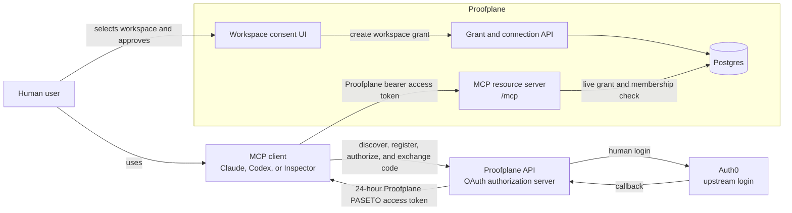
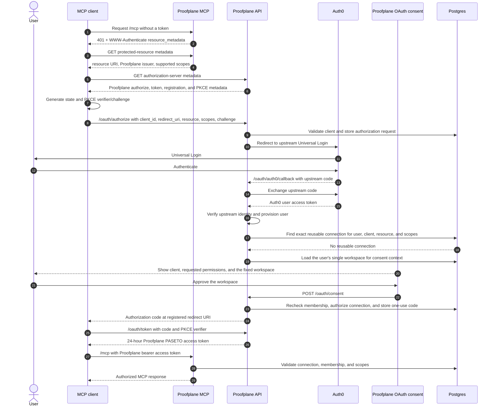
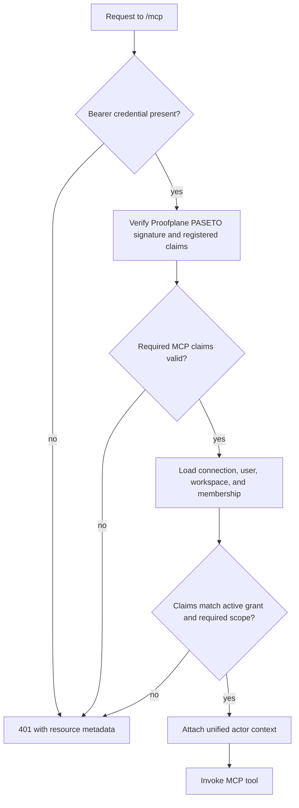
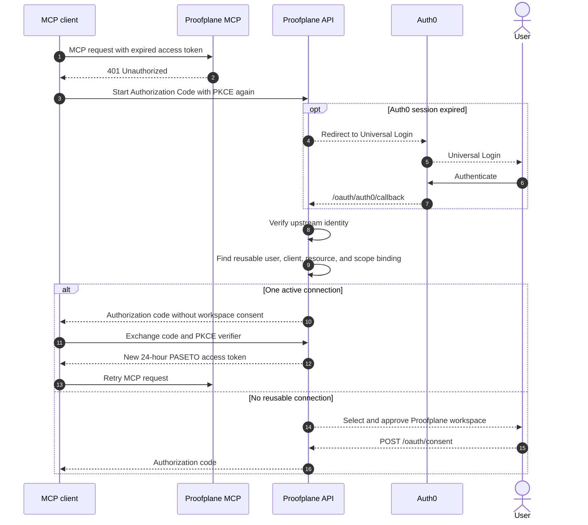

# Agent Connector Onboarding Spec

> **Decision revision — 2026-07-09 (shipped in PR #42):** Three product
> decisions landed with the working Codex OAuth connection and now supersede
> earlier text throughout this spec:
>
> 1. **API-token (`ppat_`) authentication was removed entirely.** The
>    `domain/api_token`, `repository/api_tokens`, `routes/api_tokens`, and
>    opaque-token authenticator modules are deleted. Proofplane-issued PASETO
>    access tokens from the OAuth facade are the **only** MCP credential. Any
>    passage below promising `ppat_` coexistence, an "advanced API-token path,"
>    or "existing `ppat_` callers remain unchanged" is obsolete. *Rationale:* a
>    non-technical, browser-authorized connection is the product; maintaining a
>    parallel long-lived-credential plane contradicted that and doubled the
>    authorization surface.
> 2. **The REST data-plane was removed.** The REST routes for controls,
>    evidence requests, and evidence submissions are deleted. **MCP is now the
>    only interface for compliance reads and writes.** REST remains only for
>    control-plane concerns (auth, `me`, workspaces, OAuth, and browser
>    attachment flows). Any "REST and MCP" or "same model as REST clients"
>    framing is obsolete. *Rationale:* the agent/MCP surface is the product
>    data-plane; a second REST data-plane was unused and doubled maintenance.
> 3. **Each user has exactly one workspace.** Consent no longer shows a
>    workspace **picker**; it displays the user's single workspace as a fixed,
>    non-editable approval (`get_workspace_with_role_for_user`). Read any
>    "select one accessible workspace" / "workspace picker" language below as
>    "approve the user's single workspace." *Rationale:* one-workspace-per-user
>    removes an entire class of cross-workspace consent-tampering surface and
>    matches how self-onboarding provisions accounts today.
>
> The sections below retain their original wording except where directly
> corrected; treat this banner as authoritative where they disagree.

## Goal

Let a non-technical operations or compliance user connect Proofplane to an AI
agent without installing a CLI, editing configuration, or copying a long-lived
API token.

The core product principle is **connect an account, not install a server**.
Proofplane remains a hosted Streamable HTTP MCP service. Compatible clients
discover Auth0, complete browser authorization, and receive credentials
without exposing them to the user or model.

## Architecture Decision

> **Revision — 2026-07-08:** Proofplane owns MCP OAuth discovery, local DCR,
> Authorization Code with PKCE, workspace consent, authorization-code
> exchange, and PASETO MCP access-token issuance. Auth0 remains only the
> upstream human identity provider used by `/oauth/auth0/callback`.

Proofplane is the OAuth authorization server facade for remote MCP clients.
Auth0 remains only the upstream human login provider behind one
Proofplane-owned Auth0 application.

Proofplane owns:

- authorization-server discovery;
- local Dynamic Client Registration for public MCP clients;
- exact redirect-URI validation;
- Authorization Code with PKCE;
- Proofplane workspace consent;
- one-use authorization-code storage;
- Proofplane PASETO access-token issuance; and
- OAuth protocol errors.

Auth0 owns:

- Universal Login and upstream human identity;
- upstream authorization-code exchange for the Proofplane first-party app; and
- human identity token verification through Auth0 JWKS.

Proofplane implements `/.well-known/oauth-authorization-server`,
`/oauth/register`, `/oauth/authorize`, `/oauth/auth0/callback`,
`/oauth/consent`, and `/oauth/token`. The initial release does not request or
issue refresh tokens. Proofplane MCP access tokens expire after 24 hours.

Proofplane remains responsible for:

- MCP Protected Resource Metadata and `401` challenges;
- selecting and approving one Proofplane workspace during authorization;
- durable agent-connection and audit records;
- Proofplane MCP PASETO access-token validation;
- live workspace membership, scope, and revocation enforcement; and
- the hosted MCP tools and application experience.

The workspace grant is integrated into the Proofplane OAuth transaction. After
upstream Auth0 login, Proofplane loads or provisions the user, reuses an exact
authorized/active connection when possible, or shows a Proofplane consent page
that creates an authorized connection and returns a one-use authorization code
to the MCP client.

This supersedes the earlier Auth0-owned MCP OAuth design.

## Current Reality

The MCP runtime and core tools use Streamable HTTP at `/mcp`. They now
authenticate requests exclusively with Proofplane-issued PASETO access tokens
from the OAuth facade described below.

_(Historical context, superseded by the 2026-07-09 banner: MCP originally also
accepted pre-provisioned, workspace-bound `ppat_` bearer tokens issued by the
website. That path was the wrong default for non-technical users — it required
creating, copying, and preserving a long-lived credential that could leak
through plaintext config or shell state, offered no browser-led consent or
reconnection, and made connection lifecycle and audit attribution
token-centric. `ppat_` authentication and the REST data-plane have since been
removed; the OAuth facade is the only path.)_

## Product Boundary

This epic delivers:

- Proofplane-backed OAuth authorization for the hosted MCP endpoint;
- one-workspace, scoped agent connections;
- a guided website flow for supported clients;
- first-class Claude/Cowork validation and direct Codex MCP setup;
- generic remote-MCP instructions as a fallback; and
- connection visibility, revocation, and attributable audit events.

This epic does not:

- run a local Proofplane server;
- issue refresh tokens in v1;
- synchronize every Proofplane workspace into Auth0 Organizations;
- pass MCP credentials through prompts, tools, logs, or browser storage;
- enable uncontrolled Dynamic Client Registration in production; or
- support unattended OAuth connections that must outlive the access token.

_(The initial proposal also promised to preserve existing API-token
authentication. Per the 2026-07-09 banner, `ppat_` authentication and the REST
data-plane were instead removed; the OAuth facade is the sole MCP credential
path.)_

Auth0 Organizations are not used for workspace binding. Auth0 currently
documents Organization user flows as
[unavailable for third-party applications](https://auth0.com/docs/get-started/applications/first-party-and-third-party-applications),
while MCP clients are third-party applications. Proofplane performs workspace
selection inside its own OAuth authorization transaction.

## Roles And Trust Boundaries

| Role | Component | Responsibility |
| --- | --- | --- |
| Resource owner | Proofplane user | Approves client access to one workspace |
| OAuth client | Claude, Codex, or another MCP harness | Holds credentials and calls MCP |
| Authorization server | Proofplane API | Runs MCP OAuth discovery, DCR, consent, code exchange, and access-token issuance |
| Upstream login provider | Auth0 | Authenticates the human user for Proofplane |
| Resource server | Proofplane MCP | Validates Proofplane PASETO tokens and serves authorized tools |
| Domain authorization service | Proofplane API and database | Owns users, workspaces, grants, and revocation |

The MCP client is not the model. Credentials remain transport metadata held by
the client and must never enter model context.



## Target Journey

1. The user chooses Claude/Cowork, Codex, or another supported agent.
2. Proofplane opens the client's native connection path where one exists.
3. The client contacts the hosted MCP endpoint and receives an OAuth
   challenge.
4. The client discovers Proofplane OAuth metadata, dynamically registers when
   needed, and opens Proofplane authorization.
5. Proofplane sends the browser to Auth0 Universal Login for human identity.
6. Proofplane shows the requested permissions and the user's single workspace
   as a fixed approval (each user has exactly one workspace; there is no
   picker).
7. Proofplane completes the authorization code flow and returns a 24-hour
   PASETO access token to the MCP client.
8. The client calls `/mcp`; Proofplane verifies the PASETO token and the live
   workspace grant.
9. Proofplane records successful use and offers a useful first prompt.
10. After token expiry, the client starts authorization again. Proofplane
    reuses an exact authorized or active workspace connection without showing
    the workspace page when it can do so safely.

The user never sees or copies the access token. If the client cannot restart
authorization automatically, the user reconnects it manually.

## Initial Authorization Flow



### Discovery

The MCP server returns `401 Unauthorized` with:

```http
WWW-Authenticate: Bearer resource_metadata="https://mcp.example/.well-known/oauth-protected-resource/mcp"
```

The protected-resource metadata identifies:

- `resource`: the canonical public MCP URI;
- `authorization_servers`: the Proofplane API issuer; and
- `scopes_supported`: the minimal MCP permission set.

The MCP server owns this endpoint under
[RFC 9728](https://datatracker.ietf.org/doc/html/rfc9728). The Proofplane API
owns authorization-server metadata under
[RFC 8414](https://datatracker.ietf.org/doc/html/rfc8414).

Proofplane constructs and validates the complete `WWW-Authenticate` header
when the MCP application is assembled. An invalid metadata URL or header value
fails startup; request handling only clones the validated header.

The MCP `resource` parameter must exactly match the configured Proofplane MCP
resource and becomes the PASETO token audience.

### Client Registration

Compatible clients use Proofplane Dynamic Client Registration when the client
supports OAuth discovery. Proofplane stores client IDs, exact redirect URIs,
grant types, and token-endpoint authentication policy.

Known clients must:

- be third-party applications;
- use Authorization Code with PKCE;
- use OAuth access tokens without depending on third-party OIDC support;
- use exact registered redirect URIs;
- be granted access only to the Proofplane MCP resource and approved scopes;
- use the `authorization_code` grant without `offline_access`; and
- expose stable client identity suitable for connection display and audit.

Proofplane DCR supports public clients with
`token_endpoint_auth_method = "none"` only. It accepts Codex-style
registrations that mention refresh tokens but issues only authorization-code
access tokens. Redirect URIs must be exact HTTPS URLs or loopback HTTP URLs.

### Auth0 Upstream Login

The Auth0 tenant defines the upstream Proofplane application used for human
login. Proofplane redirects `/oauth/authorize` requests to Auth0 Universal
Login, exchanges the upstream code at Auth0, verifies the returned user access
token through the configured issuer, audience, and JWKS URL, and then resumes
the Proofplane-owned OAuth transaction.

Auth0 does not issue MCP access tokens, hold MCP client registrations, select
workspaces, or receive agent-connection claims. The MCP runtime validates only
Proofplane-issued PASETO access tokens for interactive OAuth connections.

## Workspace Grant Flow

Auth0 does not know Proofplane workspace membership. Proofplane integrates the
workspace decision directly into `/oauth/authorize`, `/oauth/auth0/callback`,
`/oauth/consent`, and `/oauth/token`.

### Ticket 001/002 delivery boundary

Ticket 001 is superseded where it made Auth0 the MCP authorization server.
The retained foundation is Protected Resource Metadata plus Auth0 human
identity verification for the upstream callback.

Ticket 002 adds durable connection persistence and lifecycle operations.
Ticket 003 adds Proofplane-hosted OAuth consent, authorization-request storage,
one-use authorization codes, and PASETO access-token issuance. Ticket 004 adds
protected-tool authorization and actor provenance.

## Agent Connection Foundation

Ticket 002 persists `agent_connections`, normalized permission rows, and
single-use authorization transactions. A partial unique constraint permits at
most one non-revoked pending, authorized, or active connection for each
user/client/resource tuple. Pending creation transactionally removes an
expired pending or authorized row before inserting its replacement; a
concurrent live creation loses to the database constraint.

Ticket 002 tests keep the same interface boundary as the implementation:
persistence and lifecycle behavior are exercised through a dedicated
repository integration suite. OAuth route tests cover the public authorization,
callback, consent, and token endpoints.

Connection records contain the Proofplane user and workspace, Auth0 subject
and client, client display-name snapshot, exact resource, lifecycle
timestamps, and no credential. Authorization transactions contain only
SHA-256 continuation and nonce digests plus a consumption timestamp. The
connection's pending expiration is the single authorization deadline used for
continuation consumption, first-use activation, and expired-row replacement. A
`workspace_permissions` lookup table defines the canonical permission
vocabulary; `agent_connection_permissions` references it. (The lookup was
originally shared with an API-token permission mapping too; with `ppat_`
removed in PR #42 the agent-connection mapping is now its only consumer.)
Continuation and nonce digests use one redacted `Sha256Digest`
domain value type; their database columns store 32-byte SHA-256 output.

Repository and service operations support pending creation, denial,
single-use continuation consumption, exact reusable lookup, activation, last
use, and revocation. Continuation consumption moves a valid pending connection
to authorized. Reuse requires exact subject, client, resource, canonical
scopes, authorized or active status, and a current workspace membership.
The repository insertion payload is named `NewPendingAgentConnection` to
distinguish generated insert data from the persisted `AgentConnection`.
Conditional repository operations return `Option` to represent whether a row
matched. At the service policy boundary, continuation consumption instead
returns `ConsumeContinuationOutcome::{Approved, Invalid}` and activation
returns `ActivationOutcome::{Activated, Rejected}`, keeping expected policy
rejection distinct from repository failure.

The OAuth API validates public-client metadata, exact redirect URIs, PKCE
inputs, resource URLs, canonical non-empty scope sets, upstream identity,
workspace membership, and one-use authorization codes before issuing a token.
Subject matching, user existence, and current membership remain service
authorization policy.

### Initial authorization and connection reuse

Proofplane permits at most one active connection for an Auth0
user/client/resource tuple. The selected workspace is a property of that
connection. Connecting the same client to another workspace requires revoking
or replacing the existing connection through a visible user flow.

For every authorization transaction targeting the MCP resource, Proofplane:

1. validates the registered public client, exact redirect URI, resource,
   scopes, response type, and PKCE challenge;
2. stores a short-lived authorization request and redirects the user to Auth0
   Universal Login;
3. exchanges the upstream Auth0 code and verifies the human identity;
4. reuses an exact authorized or active connection when the same user, client,
   resource, scopes, and workspace membership still match;
5. otherwise renders `/oauth/consent` with the verified client, requested
   scopes, and the user's single workspace shown as a fixed approval;
6. on approval, rechecks membership, creates or updates the authorized
   connection, and stores a one-use authorization-code digest; and
7. exchanges the code plus PKCE verifier for a 24-hour Proofplane PASETO MCP
   access token.

The consent endpoint must not trust a workspace, scope, client, or user value
submitted by the browser. It acts on the stored authorization request, the
verified upstream user, the registered client, and current database
membership. Denial or abandoned authorization leaves no usable credential.

### Access-token expiry and reauthorization

Proofplane issues no MCP refresh token. When the 24-hour access token expires,
the MCP server returns `401 Unauthorized` and the client must start
Authorization Code with PKCE again.

The best case is nearly silent:

1. the client automatically restarts authorization;
2. the Auth0 browser session is still active;
3. Proofplane finds exactly one reusable connection; and
4. Proofplane returns a new code without login or workspace interaction.

If the Auth0 session has expired, the user signs in again. If the connection
was revoked, replaced, or is otherwise unavailable, the user completes the
workspace step again. If the client does not automatically restart OAuth, its
tools remain disconnected until the user selects its Authenticate or
Reconnect control.

Automatic reauthorization is client behavior, not guaranteed by MCP. The
Claude/Cowork and Codex release gates must verify their behavior on access-token
expiry. This release does not support background or unattended OAuth work
beyond the token lifetime. (Unattended callers previously used `ppat_`
credentials; per the 2026-07-09 banner that path no longer exists, so
unattended agent access is out of scope until a replacement is designed.)

## Access Token Contract

The MCP server accepts Proofplane-issued PASETO access tokens for the
interactive OAuth path. The token is issued by `/oauth/token` only after a
valid authorization code and PKCE verifier are consumed.

| Claim | Meaning |
| --- | --- |
| `iss` | Exact configured Proofplane API issuer |
| `aud` | Canonical Proofplane MCP resource URI |
| `sub` | Auth0 user subject for the approved human |
| `client_id` | Registered Proofplane OAuth client ID |
| `connection_id` | Durable Proofplane agent connection |
| `workspace_id` | Workspace selected during consent |
| `exp`, `iat` | Token lifetime |
| `scope` | Proofplane-approved MCP scopes |

Every scope must be one of the six MCP workspace scopes. Tokens contain
identifiers and scopes only, never Auth0 credentials, user content, or
workspace data.

The `scope` claim and persisted connection permissions must agree exactly.
The resource server never trusts token claims without the Proofplane PASETO
signature, issuer, audience, and lifetime checks.

## Runtime Authorization



For every OAuth-backed MCP request, Proofplane:

1. verifies the PASETO signature against the configured MCP OAuth keyring;
2. validates `iss`, `aud`, `exp`, `iat`, user `sub`, `client_id`, connection,
   workspace, and known scopes;
3. loads the named authorized or active connection;
4. requires its user, workspace, client, resource, and permissions to match;
5. atomically activates a valid, unexpired authorized connection or requires an
   active connection, and requires membership to remain active;
6. checks the tool's required scope; and
7. records `last_used_at` and an agent-connection audit actor.

The database check makes revocation and membership removal immediate even
while a PASETO remains cryptographically valid.

Agent-backed MCP write tools persist agent provenance directly. Evidence
submissions and attachment upload grants record their agent-connection issuer
(`submitted_by_agent_connection_id` / `issued_via_agent_connection_id`), so
OAuth agent operations do not create or rely on synthetic API-token
identifiers. The parallel `*_api_token_id` columns remain in the schema but are
vestigial now that `ppat_` authentication is removed (see the 2026-07-09
banner); every agent-backed write populates the agent-connection side. Browser
upload sessions created
from agent-issued attachment grants preserve the agent-connection issuer in
their signed session token, downstream attachment download grants, and audit
records.

Invalid credentials return a generic `401`. Workspace and permission failures
inside tools remain concealed as not-found responses where the existing MCP
contract requires that behavior. Dependency failures return server errors and
must not be collapsed into OAuth client errors.

## Expiry, Reauthorization, And Revocation



When a user revokes a connection, Proofplane first commits local revocation.
That immediately blocks all access tokens through the runtime database check.
Proofplane refuses to reuse a revoked connection. A visible authorization
attempt may create a new authorized connection after the user approves a
workspace.

Proofplane may also revoke the Auth0 user grant as credential hygiene. Local
revocation remains authoritative because an already-issued access token is
otherwise valid until its 24-hour expiry.

An expired access token cannot be refreshed. Reauthorization always produces
a new authorization code and access token.

## Scope Model

Proofplane exposes the existing workspace permission vocabulary:

- `read_evidence_requests`
- `write_evidence_requests`
- `read_evidence_submissions`
- `write_evidence_submissions`
- `read_controls`
- `write_controls`

`offline_access` is not advertised, requested, or accepted in this release.

The registered OAuth client and authorization request limit which scopes a
client may request. The user reviews the concrete requested scopes during the
Proofplane workspace step. Proofplane persists the approved set and intersects
it with the signed token on every request. A tool never escalates a missing
scope.

## Persistence And Audit

Proofplane stores:

- `agent_connections`, with at most one active connection per
  user/Auth0-client/resource tuple;
- `oauth_clients`, with local public-client IDs and exact redirect URIs;
- one-use OAuth authorization requests and authorization-code digests;
- a single-use consent-continuation nonce or digest;
- structured authorization, use, rejection, and revocation audit events.

An agent connection contains:

- Proofplane connection, user, and workspace IDs;
- Auth0 subject and client ID;
- a client display-name snapshot;
- MCP resource and approved scopes;
- pending expiry, activation, last-use, and revocation timestamps; and
- no raw access token, authorization code, or signing key.

Proofplane stores only digests for one-use authorization codes and consumes
them atomically during `/oauth/token` exchange.

Audit events use identifier-only fields and distinguish human and
agent-connection actors (the API-token actor type was removed with `ppat_` in
PR #42). Auth0 tenant logs remain the source for OAuth
issuance events; Proofplane audit records domain approval, runtime use, and
local revocation.

## Public Endpoints And Configuration

Required public roles are:

- MCP resource URL, such as `https://mcp.proofplane.com/mcp`;
- Proofplane API issuer URL, such as `https://api.proofplane.com/`;
- Auth0 issuer URL;
- Auth0 JWKS URL;
- Auth0 upstream OAuth application client ID, secret, and callback path;
- Proofplane MCP OAuth PASETO keyring; and
- `mcp.allowed_hosts`: the `Host` values the Streamable HTTP MCP transport
  accepts (rmcp DNS-rebinding protection). Empty keeps rmcp's secure
  loopback-only default (`localhost`, `127.0.0.1`, `::1`); a hosted/tunnelled
  deployment must list its public MCP host or every MCP request 403s. A
  *set-but-empty* list would disable the check entirely, so Proofplane only
  overrides the default when the configured list is non-empty.

The MCP resource URL is both the protected resource identifier and Proofplane
PASETO audience. It must be identical in client requests, protected-resource
metadata, token validation, and connection records.

Production endpoints use HTTPS. Local unit and integration tests use local
JWK fixtures for upstream Auth0 token verification and PASETO key fixtures for
MCP access tokens. End-to-end Auth0 testing uses a dedicated development
tenant and an externally reachable preview environment for the upstream
callback. Because the OAuth authorization server and the MCP data plane run on
two origins (`public_api_base_url` and `mcp.resource`), a client like Claude
must reach both; local preview uses two ngrok tunnels — see
[CONTRIBUTING.md](../../../CONTRIBUTING.md) § Connecting Codex or Cowork.

The MCP OAuth PASETO keyring is rotated independently of Auth0 upstream login
keys.

The initial MCP deployment may use one replica or ingress stickiness keyed by
`Mcp-Session-Id`. The session ID is transport state, never authorization.

## Website Experience

The website:

- asks which agent the user uses;
- launches the best verified client-specific connection path;
- hosts the Proofplane OAuth workspace-consent route;
- clearly displays client identity, requested permissions, and workspace;
- lists authorized connections and supports local revocation;
- explains that OAuth connections may require reconnection after 24 hours;
- provides an explicit Authenticate or Reconnect action when the client cannot
  restart OAuth automatically;
- distinguishes "authorized" from external client connection health; and
- offers a first useful SOC 2 prompt.

(An earlier draft kept API-token setup as an advanced path; per the 2026-07-09
banner that path was removed and OAuth is the only supported setup.)

The consent route is part of the Proofplane OAuth transaction. It acts only on
a valid stored authorization request and verified upstream identity, and it
always rechecks membership on approval. A normal website session alone cannot
mint an agent connection.

Proofplane records an authorized connection when the workspace is approved and
marks it active on the first valid OAuth-backed MCP request. The agent harness
still owns whether its transport remains connected and tools are mounted.
`last_used_at` is audit/debug metadata, not a readiness gate.

## Client Distribution

### Claude And Cowork

Proofplane ships as a hosted remote connector. The initial release uses a
custom connector URL; Claude and Cowork share one hosted-surface connector
infrastructure and the single redirect URI
`https://claude.ai/api/mcp/auth_callback`. Claude registers itself via `oauth_dcr`
(public client, S256 PKCE), so no manual client setup is required for the
custom-connector path. The only server change required was making the MCP
transport's `Host` allowlist configurable (`mcp.allowed_hosts`); without it a
hosted host 403s. Directory submission is a later step and, at scale, Claude
discourages DCR in favor of CIMD or Anthropic-held client credentials
(`oauth_anthropic_creds`).

The release smoke test must prove that Claude follows Protected Resource
Metadata to the Proofplane issuer, completes Proofplane workspace consent, and
sends a Proofplane PASETO access token with the required claims. Because v1
issues no refresh token, the test must also record the user-visible reconnect
behavior after the 24-hour access token expires. See
[CONTRIBUTING.md](../../../CONTRIBUTING.md) § Connecting Codex or Cowork for the
local ngrok setup.

### Codex

Codex ships through direct remote MCP configuration, not a Proofplane Codex
plugin. Codex discovers Proofplane Protected Resource Metadata, follows
Proofplane authorization-server metadata, dynamically registers a public
Proofplane OAuth client, completes PKCE browser authorization, passes through
Proofplane workspace consent, and uses Proofplane PASETO access tokens without
a copied Proofplane API token.

The validated setup path is `codex mcp add` followed by `codex mcp login`.
No Proofplane-owned `proofplane-soc2` plugin, marketplace package, bundled
workflow skill, or plugin-specific OAuth path is required for this epic. If a
Codex surface cannot keep the OAuth callback listener alive across the
workspace-consent round trip, restarting that surface and retrying is an
observed recovery path, but the final supported reconnect behavior still needs
release validation.

### Other Clients

Generic clients receive the hosted MCP URL and a capability matrix. OAuth is
offered to clients with supported discovery, redirect, and Proofplane DCR
behavior. Clients without a supported OAuth/DCR path are unsupported for now:
with `ppat_` removed (see the 2026-07-09 banner) there is no advanced
bearer-token fallback, so such clients cannot connect until they gain
OAuth/DCR support or a replacement unattended-credential mechanism is designed.

## Compatibility And Failure Behavior

- Unknown issuers, audiences, connections, workspaces, scopes, and malformed
  client identities fail closed.
- Missing or malformed OAuth authorization state cannot create a connection.
- Denied Auth0 consent or abandoned code exchange leaves no active connection;
  the pending or authorized grant expires.
- A user without current workspace membership cannot authorize or reuse a
  connection.
- Expired PASETO access tokens receive `401` and require a new authorization-code
  flow.
- Revocation and membership removal invalidate MCP access immediately.
- Auth0 or Proofplane dependency failure does not fall back to shared or
  long-lived credentials.
- An unsupported client receives honest guidance that it cannot connect yet
  (there is no `ppat_` fallback).
- Client-directory rejection does not block custom-connector OAuth setup.

## Testing

- Auth0 unit tests validate upstream JWT signature, algorithm, issuer,
  audience, lifetime, and user subject with local JWK fixtures.
- OAuth and MCP tests cover DCR validation, authorization requests, callback,
  consent, one-use authorization-code exchange, PASETO token validation,
  expiry, live grant checks, and membership enforcement.
- MCP protocol tests validate `401` challenges and Protected Resource Metadata.
- Integration tests cover workspace isolation, live membership removal,
  connection revocation, token expiry, and reauthorization. (The former
  `ppat_` coexistence tests were dropped when API tokens were removed in
  PR #42.)
- Browser tests cover workspace approval, denial, expiry, replay, and malformed
  OAuth transactions.
- Preview smoke tests exercise initial and repeated Proofplane Authorization
  Code with PKCE using MCP Inspector and Codex DCR.
- Release smoke tests exercise Claude/Cowork and Codex against a
  production-like environment, including callback listener behavior and
  behavior after token expiry.

Auth0-specific tests remain limited to the upstream human login token
verification boundary.

## Delivery Gates And Open Decisions

Tickets 001 and 003 have confirmed these capabilities in development:

1. Protected Resource Metadata discovery.
2. Proofplane authorization-server metadata.
3. Proofplane Dynamic Client Registration for compatible public clients.
4. Authorization Code with PKCE through MCP Inspector and Codex.
5. Browser authorization through Auth0 upstream login and return to
   Proofplane.
6. A 24-hour Proofplane PASETO access-token configuration without
   `offline_access`.
7. Codex and MCP Inspector browser authorization through Proofplane workspace
   consent and back to the MCP client callback.

The Inspector 0.22.0 callback then bypassed its configured proxy. That external
harness limitation does not block the authorization foundation: Proofplane
discovery reached the OAuth flow, browser authentication completed, and tests
cover upstream Auth0 identity verification. Recovery after token expiry is a
client-specific delivery check in tickets 005 through 008.

Tickets 002 and 003 still need final smoke coverage for denial and
authorized/active connection reuse. Ticket 004 remains responsible for
activating authorized connections on the first valid MCP request and enforcing
the claims on protected tools.

Ticket 006 research against the
[Claude connector auth docs](https://claude.com/docs/connectors/building/authentication)
resolved most Claude/Cowork questions:

- **DCR:** Claude supports `oauth_dcr` out of the box (public client, S256
  PKCE), and its hosted redirect `https://claude.ai/api/mcp/auth_callback` is
  accepted by the existing validator — no manual registration needed for the
  custom-connector path.
- **Host allowlist (the one code gap):** the rmcp transport rejected
  non-loopback `Host` headers; ticket 006 adds `mcp.allowed_hosts` so a hosted
  MCP host is accepted. This was the reason Codex (localhost) worked but a
  hosted Claude would not.
- **Token expiry (accepted v1 behavior):** Claude refreshes reactively on `401`
  and proactively before expiry, and expects a refresh token. v1 issues none, so
  Claude re-runs the full authorization-code flow every ~24h; the
  reusable-connection short-circuit can make that near-silent when the Auth0
  session is live. This is the accepted, documented v1 limitation. Refresh-token
  support (advertise `offline_access`, issue and rotate refresh tokens, return
  `invalid_grant`) is a deferred follow-up.

Open items still validated live in ticket 006: the exact user-visible reconnect
behavior on expiry, and whether Claude sends `resource` and a non-empty `scope`
on `/oauth/authorize` (both currently required). At directory scale Claude
discourages DCR in favor of CIMD or `oauth_anthropic_creds` — a separate
distribution follow-up. Whether generic OAuth warrants additional DCR abuse
controls also remains open.

If a first-class client cannot recover from access-token expiry with an
acceptable visible or automatic authorization flow, it must not be marketed
as a persistent no-token connection. Unattended callers previously fell back to
`ppat_` authentication; with that path removed in PR #42, unattended agent
access is unsupported until a replacement credential mechanism is designed.

## Distribution Order

1. Validate Proofplane OAuth capability gates with MCP Inspector.
2. Ship connection persistence.
3. Ship workspace consent, authorization-code exchange, and MCP workspace
   grant binding.
4. Ship connection listing, revocation, and guided website setup.
5. Validate Claude/Cowork custom connector behavior.
6. Document direct Codex MCP setup and reconnect behavior.
7. Prepare directory or broader marketplace submission only for clients that
   need that distribution path.

## Reference Material

- [MCP Authorization specification](https://modelcontextprotocol.io/specification/2025-11-25/basic/authorization)
- [Auth0 MCP authorization flow](https://auth0.com/ai/docs/mcp/intro/why-auth-for-mcp)
- [Auth0 MCP client registration](https://auth0.com/ai/docs/mcp/guides/registering-your-mcp-client-application)
- [Auth0 Resource Parameter Compatibility Profile](https://auth0.com/ai/docs/mcp/guides/resource-param-compatibility-profile)
- [RFC 9728: Protected Resource Metadata](https://datatracker.ietf.org/doc/html/rfc9728)
- [RFC 8707: Resource Indicators](https://datatracker.ietf.org/doc/html/rfc8707)
- [RFC 9700: OAuth Security Best Current Practice](https://datatracker.ietf.org/doc/html/rfc9700)

## Revisions

- 2026-07-09: PR #42 shipped the working Codex OAuth connection and three
  product decisions recorded in the banner at the top of this spec: removed
  `ppat_` API-token authentication, removed the REST data-plane (MCP is now the
  only compliance data interface), and restricted each user to a single
  workspace (consent shows a fixed workspace, not a picker). Tickets 002 and
  003 moved to Done alongside the already-Done 004 and 007.
- 2026-07-07: Switched MCP OAuth to a Proofplane-owned facade. Proofplane now
  publishes authorization-server metadata, accepts local DCR, runs
  Authorization Code with PKCE, issues 24-hour MCP PASETO access tokens, and
  validates them in MCP. Auth0 remains only the upstream human login provider.
- 2026-07-07: Codex and MCP Inspector completed the real development DCR and
  consent path. Direct Codex MCP OAuth is the Codex integration path for this
  epic; the Proofplane Codex plugin is removed from scope.
- 2026-07-07: Added an explicit `authorized` agent-connection status.
  Workspace approval creates an authorized row, and first valid MCP tool use
  moves it to `active`.
- 2026-07-07: Completed MCP runtime authorization for Auth0 agent connections.
  Protected tool calls now bind connection/workspace claims to authorized or
  active rows, record first-use activation and last use, and persist
  agent-connection provenance for submissions and attachment upload grants.
- 2026-07-06: Renamed the pending connection repository insertion payload to
  `NewPendingAgentConnection` to distinguish it from the persisted entity.
- 2026-07-06: Consolidated API-token, continuation, and nonce digest wrappers
  into one redacted `Sha256Digest` domain value type without changing
  persisted bytes.
- 2026-07-06: Made continuation-consumption and activation policy outcomes
  explicit at the service boundary while retaining repository `Option`
  row-match semantics.
- 2026-07-06: Made `agent_connections.pending_expires_at` the sole pending
  authorization deadline and removed the duplicate expiration from
  authorization transactions.
- 2026-07-06: Repository lifecycle tests have a dedicated module.
- 2026-07-06: Deferred pending-creation validation to ticket 003's consent
  route while retaining identity and membership policy in the service.
- 2026-07-06: Centralized the workspace permission vocabulary in a lookup table
  referenced by both API-token and agent-connection permission mappings while
  retaining separate owner relationships.
- 2026-07-05: Split the former grant-delivery ticket into 002 connection
  persistence, 003 workspace consent, and 004 MCP runtime enforcement.
  Renumbered the prior tickets 003-006 to 005-008.
- 2026-07-05: Closed ticket 001 after the development tenant and Inspector
  demonstrated discovery, PKCE browser authorization, and return from Auth0.
  Inspector 0.22.0's proxy-bypassing callback behavior is recorded as an
  external harness limitation. Kept repeated-authorization connection reuse in
  tickets 002-003 and post-expiry reconnect validation in the downstream client
  delivery tickets.
- 2026-07-04: Moved MCP authentication-challenge construction to application
  assembly so invalid metadata URLs or header values fail startup instead of
  panicking while handling an unauthorized request.
- 2026-07-02: Adopted Auth0's default 86,400-second (24-hour) MCP access-token
  lifetime. Live grant and membership checks in ticket 004 remain the
  immediate-revocation boundary.
- 2026-07-02: Selected Auth0's default `access_token` dialect for the MCP
  resource. The token contract uses Auth0's `azp` client identifier; RFC 9068
  fields are not required.
- 2026-07-02: Defined the 001/002 boundary. Ticket 001 admits verified Auth0
  principals for MCP initialization and tool discovery but denies protected
  tools; tickets 002-004 add durable grants and live authorization.
- 2026-07-02: Removed `offline_access` and connection-bound refresh metadata
  from the initial release. This revision originally selected eight-hour
  access tokens; the later 24-hour revision above supersedes that lifetime.
  Repeat authorization reuses the one active user/client/resource connection
  without a Proofplane redirect when possible; otherwise the user reconnects
  visibly.
- 2026-06-29: Initial proposal selected hosted remote MCP, native client
  distribution, and API-token compatibility.
- 2026-06-29: Limited first-class distribution to Claude/Cowork and Codex,
  leaving other clients on generic fallback guidance.
- 2026-06-29: Established one-workspace grants, concrete workspace permission
  scopes, configurable public endpoints, and Proofplane-owned connection
  lifecycle records.
